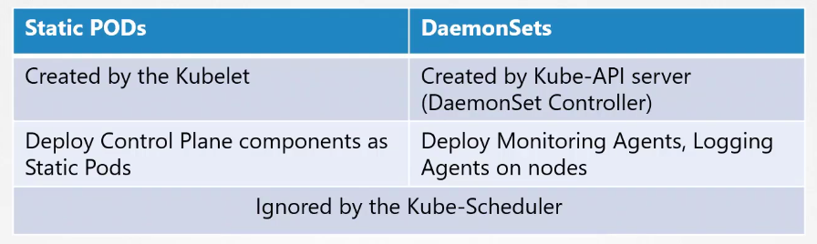
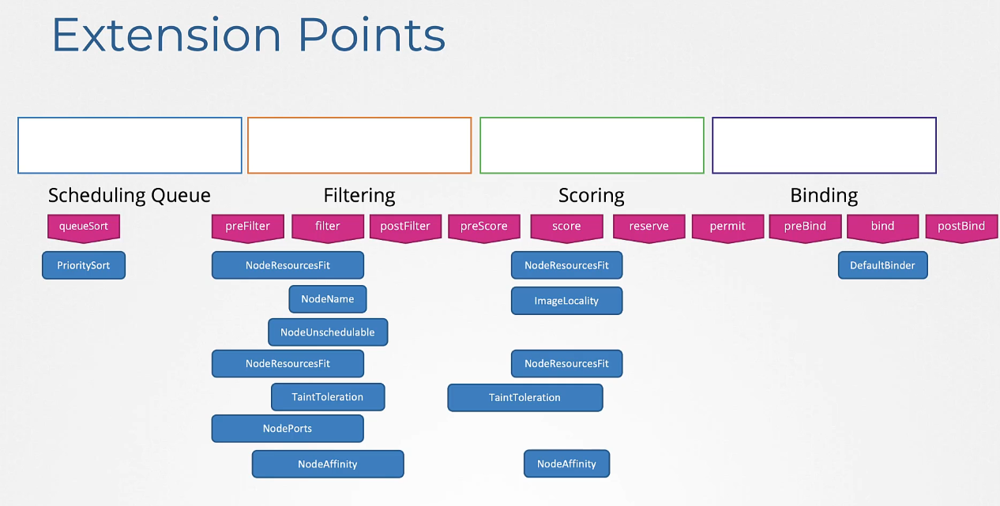
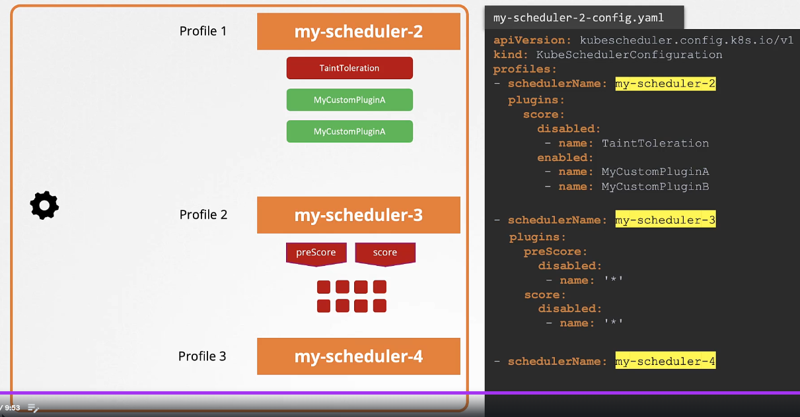

# Section 3 Scheduling

## Manually scheduling pods

If you have no scheduler, you can add `nodeName` to the pod definition yaml. You can only specify it at creation time.

Check the `kube-scheduler` status:

```bash
kubectl get po -n kube-system
```

...look for `kube-scheduler`. If it is not present or broken you must manually schedule pods.

If the pod is already made, you can use a `Binding` object. But you must POST.

```sh
curl --header "Content-Type:application/json" --request POST --data '{"apiVersion":"v1", "kind":"Binding", "metadata": { "name": "nginx"},"target":{"apiVersion":"v1","kind":"Node","name":"node02"}}'
```

Lab notes...

```sh
kubectl replace --force -f nginx.yaml # Delete and recreate it.
kubectl get pods --watch
```

You cannot literally "move"... you have to delete a pod and recreate it somewhere else.

Check for which node its on:

```sh
kubectl get pods -o wide
```

## Labels and Selectors

```sh
kubectl get pods --selector app=App1
```

```yaml
apiVersion: apps/v1
kind: ReplicaSet
metadata: 
  name: simple-webapp
  labels: # Labels for the ReplicaSet
    app: App1 
    function: Front-end
spec:
  replicas: 3
  selector:
    matchLabels:
      app: App1 # THIS LABEL IS THE REAL MATCHER TO CONTAINERS BELOW
  template:
    metadata:
      labels: # Labels for the Pod
        app: App1 
        function: Front-end
    spec:
      containers:
      - name: simple-webapp
        image: simple-webapp
```

Annotations are used for Integrations: "Versions, Release Numbers, Git Hash"

Lab notes...

```sh
kubectl get pods --selector env=dev --no-headers | wc -l
```

Multiple filters (AND benavior)

```sh
kubectl get all --selector env=prod,bu=finance,tier=frontend
```

## Taints and Tolerations

Taint is a repellant.

Used to drive what pods can be scheduled on what nodes.

Node 1 create a Taint (Blue).

Pod D create a Toleration (Blue).

Taints are set on Nodes.... Tolerations are set on Pods.

```sh
kubectl taint nodes node-name key=value:taint-effect #NoSchedule| PreferNoSchedule | NoExecute
```

Taint Effect

* NoSchedule = Pods cannot be scheduled on the node
* PreferNoSchedule = Try to avoid
* NoExecute = New Pods will not be scheduled, Existing pods will be moved

```yaml
apiVersion: v1
kind: Pod
metadata:
  name: myapp-pod
spec:
  containers:
  - name: nginx-container
    image: nginx
  
  tolerations:
  - key: "app"
    operator: "Equal"
    value: "blue"
    effect: "NoSchedule"
```

Taints do not guarantee a pod will run on a node. To achieve that you must use NodeAffinity. Taints only restrict what can run on a node. Pods with a set toleration can still be scheduled to other nodes by the scheduler.

Lab Notes...

Control Plane nodes are typically tainted as 'NoSchedule'.

## Node Selectors

Pods can be assigned to particular nodes.

```yaml
apiVersion: v1
kind: Pod
...
  nodeSelector:
    size: Large
```

NOTE: They cannot be assigned to a range. They can only be assigned to specifically labeled node.

## Node Affinity

```yaml
nodeAffinity:
  requiredDuringSchedulingIgnoredDuringExecution:
    nodeSelectorTerms:
    - matchExpressions:
      - key: size
        operator: Exists
```

Current:
`requiredDuringSchedulingIgnoredDuringExecution`

`preferredDuringSchedulingIgnoredDuringExecution`

Future:
`requiredDuringSchedulingRequiredDuringExecution`

| Affinity Type                                   | During Scheduling | During Execution | Status  | Notes |
|-------------------------------------------------|-------------------|------------------|---------|-------|
| requiredDuringSchedulingIgnoredDuringExecution  | Required          | Ignored          | Active  |       |
| preferredDuringSchedulingIgnoredDuringExecution | Preferred         | Ignored          | Active  |       |
| requiredDuringSchedulingRequiredDuringExecution | Required          | Required         | Planned |       |

Lab notes...

Label a node:

```sh
kubectl label node node01 color=blue
```

Create a deployment...

```sh
kubectl create deployment blue --image=nginx --replicas=3
```

Deployment using affinity...

```yaml
apiVersion: apps/v1
kind: Deployment
metadata:
  annotations:
    deployment.kubernetes.io/revision: "1"
  generation: 1
  labels:
    app: blue
  name: blue
  namespace: default
spec:
  progressDeadlineSeconds: 600
  replicas: 3
  revisionHistoryLimit: 10
  selector:
    matchLabels:
      app: blue
  strategy:
    rollingUpdate:
      maxSurge: 25%
      maxUnavailable: 25%
    type: RollingUpdate
  template:
    metadata:
      creationTimestamp: null
      labels:
        app: blue
    spec:
      containers:
      - image: nginx
        imagePullPolicy: Always
        name: nginx
        resources: {}
        terminationMessagePath: /dev/termination-log
        terminationMessagePolicy: File
      dnsPolicy: ClusterFirst
      restartPolicy: Always
      schedulerName: default-scheduler
      terminationGracePeriodSeconds: 30
      affinity:
        nodeAffinity:
          requiredDuringSchedulingIgnoredDuringExecution:
            nodeSelectorTerms:
            - matchExpressions:
              - key: "color"
                operator: "In"
                values: 
                - "blue"
...

# Deployment of nginx as 'red' where a label key exists on the control-plane
      affinity:
        nodeAffinity:
          requiredDuringSchedulingIgnoredDuringExecution:
            nodeSelectorTerms:
            - matchExpressions:
              - key: "node-role.kubernetes.io/control-plane"
                operator: "Exists"
```

## Taints and Tolerations vs Node Affinity

Using both in combination allows for specific placement and reduces the chance something cannot be scheduled on a specific node.

## Resource Requirements nad Limits

```yaml
apiVersion: v1
kind: Pod
metdata:
  name: something
  namespace: default
  labels:
    name: something
spec:
  containers:
  - name: something
    image: something-image
    ports:
      - containerPort: 8080
    resources:
      requests:
        memory: "4Gi"
        cpu: 2
...
      limits:
        memory: "2Gi"
        cpu: 2
```

LimitRange on Cluster

```yaml
apiVersion: v1
kind: LimitRange
metadata:
  name: cpu-resource-constraint
spec:
  limits:
  - default:
      cpu: 500m
    defaultRequest:
      cpu: 500m
    max:
      cpu: "1"
    min:
      cpu: 100m
    type: Container

apiVersion: v1
kind: LimitRange
metadata:
  name: memory-resource-constraint
spec:
  limits:
  - default:
      memory: 1Gi
    defaultRequest:
      memory: 1Gi
    max:
      memory: 1Gi
    min:
      memory: 500Mi
    type: Container
```

ResourceQuota ... namespace level resource constraints

```yaml
apiVersion: v1
kind: ResourceQuota
metadata:
  name: my-resource-quota
spec:
  hard:
    requests.cpu: 4
    requests.memory: 4Gi
    limits.cpu: 10
    limits.memory: 10Gi
```

> NOTE: You cannot edit most of the fields on an actively running pod. The only ones editable are:
> spec.containers...image
> spec.initContainers...image
> spec.activeDeadlineSeconds
> spec.tolerations
> However, you can edit the pod sections of a Deployment as the deployment will kill the pod and redeploy.

## Daemonsets

Log Monitoring, kube-proxy, weave-net... all require a pod running on each node.

DaemonSets are setup exactly the same as ReplicaSets with only the 'kind' being different.

K8s < 1.12 used 'nodeName' on each pod to instruct the pod on which node to run, but since 1.12 K8s uses affinity rules to accomplish the same.

Lab Notes...

There is no declarative way to generate a DaemonSet using `kubectl create`. You must use a Deployment or other object and then adjust it.

```bash
kubectl create deploy nginx --image=nginx --dry-run=client -o yaml | \
    sed '/null\|{}\|replicas/d;/status/,$d;s/Deployment/DaemonSet/g' > nginx-ds.yaml
```

`strategy`,`status`,`replicas` must be removed for a daemonset.

## Static Pods

If a kubelet is managing a node independently from a cluster.

kubelet can be configured to read certain directorys...`/etc/kubernetes/manifests`.

These are known as static pods... Only pods can be created this way.

Usually this configuration is stored as `--pod-manifest-path` in the kubelet.service file or `staticPodPath` in the kubeconfig.yaml and the path to the kubeconfig.yaml is stored on the kubelet.service as `--config`.

Cluster setup using kubeadm use the `--config` option.

Kubelet handling local pods...

1. From static pods
2. kube-apiserver

Static pods can only be deleted on the local node using the manifests files.

All static pods are reflected in the kube-apiserver with the appended node name.



Find your config location.

```sh
systemctl cat kubelet 
...
Environment="KUBELET_CONFIG_ARGS=--config=/var/lib/kubelet/config.yaml"
...
```

OR examine the kubelet config file.

```sh
cat /var/lib/kubelet/config.yaml
```

View that file to discover the staticPodPath.

Command Option rather than Executing a /bin/sh

```sh
kubectl run static-busybox --image=busybox --restart=Never --dry-run=client -o yaml --command -- sleep 1000 > static-busybox.yaml
```

## Multiple Schedulers

```yaml
apiVersion: kubescheduler.config.k8s.io/v1
kind: KubeSchedulerConfiguration
profile:
- schedulerName: my-scheduler
```

## Configuring Scheduler Profiler



* Scheduling Queue
  * Scheduling Plugins
    * PrioritySort
  * Extension Points
    * queueSort
* Filtering
  * Scheduling Plugins
    * NodeResourcesFit
    * NodeName
    * NodeUnschedulable
  * Extension Points
    * preFilter
    * filter
    * postFilter
* Scoring (weights)
  * Scheduling Plugins
    * NodeResourcesFit
    * ImageLocality
  * Extension Points
    * preScore
    * score
    * reserve
    * permit
* Binding
  * Scheduling Plugins
    * DefaultBinder
  * Extension Points
    * preBind
    * bind
    * postBind

Instead of deploying multiple schedulers as processes, you can deploy schedulers under the main scheduler with just a different profile.

