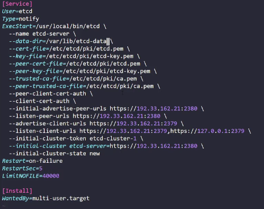

# Section 6 Cluster Maintenance

## OS Upgrades

Pod Eviction Timeout: the amount of time a node can be down.

```bash
kubectl drain node-1
kubectl cordon node-1
kubectl uncordon node-1
```

## Cluster Upgrades

> NOTE Use the newer repositories at `pkgs.k8s.io`

kubeapi-server must always be the version higher.

Only the last 3 minor versions are supported for upgrading.

Its best to upgrade your cluster one minor version at a time.

## Cluster Upgrade Commands

```sh
cat /etc/release
```

```sh CONTROLPLANE NODES
# Upgrade kubeadm
vim /etc/apt/sources.list.d/kubernetes.list

# You should see...
deb [signed-by=/etc/apt/keyrings/kubernetes-apt-keyring.gpg] https://pkgs.k8s.io/core:/stable:/v1.29/deb/ /

# Change the v1.29 to v1.30
deb [signed-by=/etc/apt/keyrings/kubernetes-apt-keyring.gpg] https://pkgs.k8s.io/core:/stable:/v1.30/deb/ /

# Find the latest patch for the version in the next step
sudo apt update
sudo apt-cache madison kubeadm

# Upgrade
sudo apt-mark unhold kubeadm && \
sudo apt-get update && sudo apt-get install -y kubeadm='1.31.0-1.1' && \
sudo apt-mark hold kubeadm

# Check
kubeadm version

sudo kubeadm upgrade plan

sudo kubeadm upgrade apply v1.31.0

# NOTE Kubelet does not upgrade after a kubeadm upgrade.

# Repeat on all controlplane nodes but use: sudo kubeadm upgrade node

# Upgrade Kubelet
kubectl drain controlplane --ignore-daemonsets

sudo apt-mark unhold kubelet kubectl && \
sudo apt-get update && sudo apt-get install -y kubelet='1.31.0-1.1' kubectl='1.31.0-1.1' && \
sudo apt-mark hold kubelet kubectl

sudo systemctl daemon-reload
sudo systemctl restart kubelet

kubectl uncordon controlplane
```

```sh WORKER NODES
# Drain on node01
kubectl drain node01 --ignore-daemonsets

# ssh node01
# Upgrade kubeadm
vim /etc/apt/sources.list.d/kubernetes.list

# You should see...
deb [signed-by=/etc/apt/keyrings/kubernetes-apt-keyring.gpg] https://pkgs.k8s.io/core:/stable:/v1.29/deb/ /

# Change the v1.29 to v1.30
deb [signed-by=/etc/apt/keyrings/kubernetes-apt-keyring.gpg] https://pkgs.k8s.io/core:/stable:/v1.30/deb/ /

# Find the latest patch for the version in the next step
sudo apt update
sudo apt-cache madison kubeadm

sudo apt-mark unhold kubeadm && \
sudo apt-get update && sudo apt-get install -y kubeadm='1.31.x-*' && \
sudo apt-mark hold kubeadm

sudo kubeadm upgrade node v1.31.0

sudo apt-mark unhold kubelet kubectl && \
sudo apt-get update && sudo apt-get install -y kubelet='1.31.0-1.1' kubectl='1.31.0-1.1' && \
sudo apt-mark hold kubelet kubectl

sudo systemctl daemon-reload
sudo systemctl restart kubelet

# exit node01

kubectl uncordon node01

```

## Backup and Restore Methods

```sh
ETCDCTL_API=3
etcdctl snapshot save snapshot.db

etcdctl stop the kubeapi-serever

etcdctl snapshot restore snapshot.db --data-dir=/etc/etcd/data
```

etcdctl is a command line client for etcd.

In all our Kubernetes Hands-on labs, the ETCD key-value database is deployed as a static pod on the master. The version used is v3.

To make use of etcdctl for tasks such as back up and restore, make sure that you set the ETCDCTL_API to 3.

You can do this by exporting the variable ETCDCTL_API prior to using the etcdctl client. This can be done as follows:

export ETCDCTL_API=3

On the Master Node:

To see all the options for a specific sub-command, make use of the -h or --help flag.

For example, if you want to take a snapshot of etcd, use:

etcdctl snapshot save -h and keep a note of the mandatory global options.

Since our ETCD database is TLS-Enabled, the following options are mandatory:

--cacert                                                verify certificates of TLS-enabled secure servers using this CA bundle

--cert                                                    identify secure client using this TLS certificate file

--endpoints=[127.0.0.1:2379]          This is the default as ETCD is running on master node and exposed on localhost 2379.

--key                                                      identify secure client using this TLS key file


Similarly use the help option for snapshot restore to see all available options for restoring the backup.

etcdctl snapshot restore -h

For a detailed explanation on how to make use of the etcdctl command line tool and work with the -h flags, check out the solution video for the Backup and Restore Lab.

Lab Notes...

```sh

ETCDCTL_API=3 etcdctl --endpoints 127.0.0.1:2379 \
  --cert=/etc/kubernetes/pki/etcd/server.crt \
  --key=/etc/kubernetes/pki/etcd/server.key \
  --cacert=/etc/kubernetes/pki/etcd/ca.crt \
  member list


ETCDCTL_API=3 etcdctl --endpoints 127.0.0.1:2379 \
  --cert=/etc/kubernetes/pki/etcd/server.crt \
  --key=/etc/kubernetes/pki/etcd/server.key \
  --cacert=/etc/kubernetes/pki/etcd/ca.crt \
  snapshot save /opt/snapshot-pre-boot.db

ETCDCTL_API=3 etcdctl --data-dir=/var/lib/etcd-data snapshot restore /opt/snapshot-pre-boot.db

etcdctl version
etcdctl --version
ETCDCTL_API=3
etcdctl --version
ETCDCTL_API=3 etcdctl --version
ETCDCTL_API=3 etcdctl version
k get po
k get po -n kube-system
k describe po etcd-controlplane -n kube-system
ETCDCTL_API=3 etcdctl snapshot save /opt/snapshot-pre-boot.db
ETCDCTL_API=3 etcdctl --endpoints 127.0.0.1:2379   --cert=/etc/kubernetes/pki/etcd/server.crt   --key=/etc/kubernetes/pki/etcd/server.key   --cacert=/etc/kubernetes/pki/etcd/ca.crt   member list
ETCDCTL_API=3 etcdctl --endpoints 127.0.0.1:2379   --cert=/etc/kubernetes/pki/etcd/server.crt   --key=/etc/kubernetes/pki/etcd/server.key   --cacert=/etc/kubernetes/pki/etcd/ca.crt   snapshot save /opt/snapshot-pre-boot.db
kubectl get po -A
kubectl get deployments -A
kubectl get deployments,svc -A
ls -la /opt/
ETCDCTL_API=3 etcdctl --data-dir=/var/lib/etcd snapshot restore /opt/snapshot-pre-boot.db
ls -la /var/lib/etcd/
ETCDCTL_API=3 etcdctl --data-dir=/var/lib/etcd-data snapshot restore /opt/snapshot-pre-boot.db
kubectl get deployments,svc -A
kubectl get deployments -A
kubectl get po -A
ls -la /etc/kubernetes/manifests/
mkdir /tmp/
mkdir /tmp/manifests
mv /etc/kubernetes/manifests/*.yaml /tmp/manifests/
kubectl get po -A
rm -rf /var/lib/etcd
ETCDCTL_API=3 etcdctl --data-dir=/var/lib/etcd snapshot restore /opt/snapshot-pre-boot.db
cp /tmp/manifests/etcd.yaml /etc/kubernetes/manifests/
cp /tmp/manifests/*.yaml /etc/kubernetes/manifests/*.yaml
ls -la /etc/kubernetes/manifests
cp /tmp/manifests/*.yaml /etc/kubernetes/manifests/
ls -la /etc/kubernetes/manifests
kubectl get po
```

> NOTE: If you use a new directory for your snapshot restore you will need to qualify that on the etcd.yaml...

```yaml
  volumes:
  - hostPath:
      path: /var/lib/<NEW DIRECTORY NAME>
      type: DirectoryOrCreate
```

> HOW DO I KNOW HOW MANY NODES ARE IN AN EXTERNAL ETCD CLUSTER?

ETCDCTL_API=3 etcdctl --endpoints 127.0.0.1:2379 \
  --cert=/etc/kubernetes/pki/etcd/server.crt \
  --key=/etc/kubernetes/pki/etcd/server.key \
  --cacert=/etc/kubernetes/pki/etcd/ca.crt \
  member list

If your etcd service is external, you will  need to edit the file...

```sh
vi /etc/systemd/system/etcd.service
```



```sh
systemctl daemon-reload

systemctl restart etd

systemctl status etcd

```

Delete the scheduler, controller-manager pods to have them restart on a control-plane node.

Then ssh into a control-plane node and perform a `systemctl restart kubelet`.

> Exam Tip

Here's a quick tip. In the exam, you won't know if what you did is correct or not as in the practice tests in this course. You must verify your work yourself. For example, if the question is to create a pod with a specific image, you must run the the kubectl describe pod command to verify the pod is created with the correct name and correct image.
