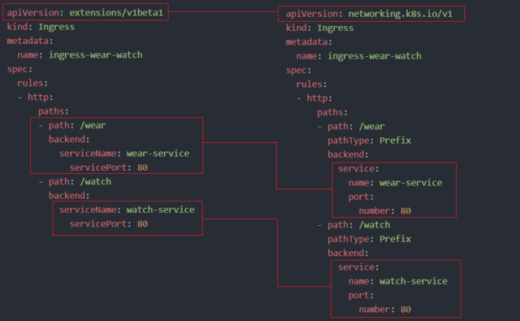

# Security

## Setting up Basic Authentication

Article on Setting up Basic Authentication
Setup basic authentication on Kubernetes (Deprecated in 1.19)
Note: This is not recommended in a production environment. This is only for learning purposes. Also note that this approach is deprecated in Kubernetes version 1.19 and is no longer available in later releases

Follow the below instructions to configure basic authentication in a kubeadm setup.

Create a file with user details locally at /tmp/users/user-details.csv

### User File Contents

password123,user1,u0001
password123,user2,u0002
password123,user3,u0003
password123,user4,u0004
password123,user5,u0005

Edit the kube-apiserver static pod configured by kubeadm to pass in the user details. The file is located at /etc/kubernetes/manifests/kube-apiserver.yaml

```yaml
apiVersion: v1
kind: Pod
metadata:
  name: kube-apiserver
  namespace: kube-system
spec:
  containers:
  - command:
    - kube-apiserver
      <content-hidden>
    image: k8s.gcr.io/kube-apiserver-amd64:v1.11.3
    name: kube-apiserver
    volumeMounts:
    - mountPath: /tmp/users
      name: usr-details
      readOnly: true
  volumes:
  - hostPath:
      path: /tmp/users
      type: DirectoryOrCreate
    name: usr-details
```

Modify the kube-apiserver startup options to include the basic-auth file

```yaml
apiVersion: v1
kind: Pod
metadata:
  creationTimestamp: null
  name: kube-apiserver
  namespace: kube-system
spec:
  containers:
  - command:
    - kube-apiserver
    - --authorization-mode=Node,RBAC
      <content-hidden>
    - --basic-auth-file=/tmp/users/user-details.csv
Create the necessary roles and role bindings for these users:


---
kind: Role
apiVersion: rbac.authorization.k8s.io/v1
metadata:
  namespace: default
  name: pod-reader
rules:
- apiGroups: [""] # "" indicates the core API group
  resources: ["pods"]
  verbs: ["get", "watch", "list"]
 
---
# This role binding allows "jane" to read pods in the "default" namespace.
kind: RoleBinding
apiVersion: rbac.authorization.k8s.io/v1
metadata:
  name: read-pods
  namespace: default
subjects:
- kind: User
  name: user1 # Name is case sensitive
  apiGroup: rbac.authorization.k8s.io
roleRef:
  kind: Role #this must be Role or ClusterRole
  name: pod-reader # this must match the name of the Role or ClusterRole you wish to bind to
  apiGroup: rbac.authorization.k8s.io
```

Once created, you may authenticate into the kube-api server using the users credentials

```bash
curl -v -k https://localhost:6443/api/v1/pods -u "user1:password123"
```

## TLS Introduction

**Symmetric encryption** uses the same certification on the client and server and the certificate is passed through the encrypted message. This is not very secure.

**Asymmetric Encryption** uses a private key and public lock. This is the use of a Keypair.

```sh
ssh-keygen

# outputs: id_rsa id_rsa.pub
```

Using OpenSSL

```sh
openssl genrsa -out my-bank.key 1024

openssl -in my-bank.key -pubout > mybank.pem

# outputs: my-bank.key mybank.pem
```

## TLS in Kubernetes - Certificate Creation

### Certificate Authority

```sh
# Generate Keys
openssl genrsa -out ca.key 2048

# Cert Sign Request
openssl req -new -key ca.key -subj  "/CN=KUBERNETES-CA" -out ca.csr

# Sign Certificates
openssl x509 -req -in ca.csr -signkey ca.key -out ca.crt
```

### Admin user

```sh
# Generate Keys
openssl genrsa -out admin.key 2048

# Cert Sign Request
openssl req -new -key admin.key -subj "/CN=kube-admin/O=systm:masters" -out admin.csr

# Sign Certificates
openssl x509 -req -in admin.csr -CA ca.crt -CAkey ca.key -out admin.crt
```

### Kube Scheduler

```sh
# Generate Keys
openssl genrsa -out scheduler.key 2048

# Cert Sign Request
openssl req -new -key scheduler.key -subj "/CN=system:kube-scheduler" -out scheduler.csr

# Sign Certificates
openssl x509 -req -in scheduler.csr -CA ca.crt -CAkey ca.key -out admin.crt
```

### Kube Controller Manager

```sh
# Generate Keys
openssl genrsa -out controller-mgr.key 2048

# Cert Sign Request
openssl req -new -key controller-mgr.key -subj "/CN=system:kube-controller-mgr" -out controller-mgr.csr

# Sign Certificates
openssl x509 -req -in controller-mgr.csr -CA ca.crt -CAkey ca.key -out admin.crt
```

### Others

Repeat for kube-proxy, kubeapi-server, kubelet

### Where to put them

You can reference them to make curl calls to the api-server.

Certificates are put them in kube-config.yaml.

### KUBE APISERVER

`kube-apiserve` uses multiple names...

```sh
openssl req -new -key apiserver.key -subj  \ "CN=kube-apiserver" -out apiserver.csr --config openssl.cnf

## OpenSSL Conf File
[req]
req_extensions = v3_req
...
[alt_name]
DNS.1 = kubernetes
DNS.2 = kubernetes.default
DNS.3 = kubernetes.default.svc
DNS.4 = kubernetes.default.svc.cluster.local
IP.1 = 10.93.0.1
IP.2 = 172.17.0.87

```

Kubelet certificates are named for their node.

## View Certificate Details

`/etc/kubernetes/manifest/kube-apiserver.yaml`

`openssl x509 -in /etc/kubernetes/pki/apiserver.crt -text -noout`


If you run into issues use on a "hard way" deployment `journalctl -u etcd.service -l`

If you cannot connect when using a kubeadm deployment use docker or nerdctl to connect and view the logs.

Lab notes...

```sh
# Inspect Certs
openssl x509 -in ca.crt -text -noout
```

> NOTE: All steps were fine, but I ran into an issue with the etcd.yaml change question. I added `server.crt` back to the file and the logs were showing etcd was still trying to find the `server-certificate.crt` file.

## Certificates API

CertificateSigningRequests Object

Generate a CSR

```sh
# Generate Keys
openssl genrsa -out new-user.key 2048

# Cert Sign Request
openssl req -new -key new-user.key -subj "/CN=kube-new-user" -out new-user.csr

cat new-user.csr | base64 #output goes into the yaml below...
```

[Certificate Signing Requests Details](https://kubernetes.io/docs/reference/access-authn-authz/certificate-signing-requests/#create-certificatesigningrequest)

```yaml
apiVersion: certificates.k8s.io/v1
kind: CertificateSigningRequest
metadata:
  name: new-user
spec:
  expirationSeconds: 600
  usages:
  - digital signature
  - key encipherment
  - server auth
  request:

    LS0tLS1CRUdJTiBDRVJUSUZJQ0FURSBSRVFVRVNULS0tLS0KTUlJQ1hUQ0NBVVVDQVFBd0dERVdN
    QlFHQTFVRUF3d05hM1ZpWlMxdVpYY3RkWE5sY2pDQ0FTSXdEUVlKS29aSQpodmNOQVFFQkJRQURn
    Z0VQQURDQ0FRb0NnZ0VCQUx3S0drTmQ3dFFjVFZVRnEwSnVLakdzbmszSUE3NU9SUnpGClN4NWhy
    R2U1MWFpYVJIWHdBVG5naWZEa1BnYkNIUVJtNXc1QTdKQmtVeVlxaEhnMG9OZ3NPeGpGSkhlcko2
    WEgKOGpnYmNkTEl4T0ROOEJMdHZqb2JOUE03NTRuYUoxNDR4a1VSWk9rakQxdHMvUmErNGJkbGUw
    MkQ1TXN6S0huTgpQVkRRRlp5SURnVmlKUWxIWEJoT0ZBNWNxajg3Ni9OV2NTNmpUeTVodGxmY1dE
    WHRPS2NSV081UzM4RXlIVVJkCnJmNEVDMTNEOGkreXBaS0xyMG5SUlFQTXdnc05zNWdaOFZ6Wkds
    NjBLSElLaUV0UlVUeWxLclQvalQzL2xzQ3MKNU5hVERNOS9YNEt0bmVOUzN6RWJZR2w0RkxpSVh2
    QmZwWWZGSGtHTjlSamdOTmhxd0trQ0F3RUFBYUFBTUEwRwpDU3FHU0liM0RRRUJDd1VBQTRJQkFR
    QXlwSzYyY1ovSnVsUzl5UTVhcWh0ckRmYWlXY0dLYThJem1PSkVtczhQCkRZYjNSRGpNM3FMSko4
    US9hOFpydzJhMzBCMmxIZHlOYlgvdWZoa2tFaUtQc210VXEySGp3ckZkN0tmZ013RDMKOWw0Qzc1
    NVFBR0RWRjU5Umc4MnEyWThWSUFaUFk0d1c1dlhOTVp5MVc5ZlZNcGNWRVRzRTlFdnVQNlptbk9J
    agoxY0w3MW5wQ21DamRmVW1QSmFYeGlIVXhjbkxSUjJzeFA2ZTV6RzREeU9rRExzWVZWNUhMSkhO
    MWhaWHZoWkYrCnRRNmJXeUl4NlBTWE1icGJnK3pxUnhYRjQrUVZqbkZKQW9kOXlwTXozakJOUkV0
    V1Z4b0gxSm1rbEpPNzNrOG8KQkZ4eFZYOVM2eGlhWEJBOVhIdnNwS1pobVRmUzZHVWU5Y01ERk82
    V2N3VEoKLS0tLS1FTkQgQ0VSVElGSUNBVEUgUkVRVUVTVC0tLS0tCg==
```

### Apply and inspect the CSR

```sh
kubectl apply -f new-user.yaml

kubectl get csr

kubectl certificate approve new-user

kubectl get csr new-user -o yaml
```

> All Certificate Management is done by the Controller Manager

Lab notes...

#### Check a Certificate Signing Request (CSR)

```sh
openssl req -text -noout -verify -in CSR.csr
```

### Check a private key

```sh
openssl rsa -in privateKey.key -check
```

#### Check a certificate

```sh
openssl x509 -in certificate.crt -text -noout
```

#### Check a PKCS#12 file (.pfx or .p12)

```sh
openssl pkcs12 -info -in keyStore.p12
```

## KubeConfig File

Clusters, Contexts, Users

Contexts join Users and Clusters

`$HOME/.kube/config`

```yaml
apiVersion: v1
kind: Config

current-context: admin@clusterX-context

clusters:

- name: clusterX
  cluster:
    certificate-authority: ca.crt # use certificate-authority-data: base64 encoded cert here
    server: https://clusterX:6443


contexts:

- name: admin@clusterX-context
  context:
    cluster: clusterX
    user: admin
    namespace: XXX


users:

- name: admin
  user:
   client-certificate: admin.crt
   client-key: client-key.crt
```

```sh
kubectl config view

kubectl config use-context prod-user@production
```

## API Groups

API Groups in the API

```sh

/metrics
/healthz
/version
/api
/apis
/logs
```

```sh

kubectl proxy # opens a proxy server locally using your local config context

curl http://localhost:8001 -k
{
  "paths": [
    "/api",
    "/api/v1",
    ...
  ]

}

```

Named API Group `/apis` are at the top and Core API Group `/apps` are under them.

## Authorization

Node-
Node Authorizer allows nodes access between nodes.

ABAC-
Attribute Based Access Control is the direct association of users with permissions.

RBAC-
Role Based Access Control is the association of users with their respective roles which have a set of permissions.

Webhook-
Open Policy Agent is a third party took that allows you to pass authorization to a separate application

Always Allow and Always Deny

Always Allow is set as default

In the API Server config...`--authorization-mode=Node,RBAC,Webhook`

## RBAC

Example `developer-role.yaml`

```yaml
apiVersion: rbac.authorization.k8s.io/v1
kind: Role
metadata: 
  name: developer
rule:
- apiGroups: [""]
  resources: ["pods"]
  verbs: ["list","get","create","delete"]
  resourceNames: ["blue","green"]
- apiGroups: [""]
  resources: ["ConfigMap"]
  verbs: ["create"]
```

Example `devuser-developer-binding.yaml`

```yaml
apiVersion: rbac.authorization.k8s.io/v1
kind: RoleBinding
metadata:
  name: devuser-developer-binding
subjects:
- kind: User
  name: dev-user
  apiGroup: rbac.authorization.k8s.io
roleRef:
  kind: Role
  name: developer
  apiGroup: rbac.authorization.k8s.io
```

```sh
kubectl get role

kubectl get rolebindings

kubectl auth can-i create deployments

kubectl auth can-i delete nodes --as dev-user # no

kubectl auth can-i delete pods --as dev-user # yes
```

Lab Notes...

```sh
controlplane ~ ✖ kubectl describe role kube-proxy -n kube-system
Name:         kube-proxy
Labels:       <none>
Annotations:  <none>
PolicyRule:
  Resources   Non-Resource URLs  Resource Names  Verbs
  ---------   -----------------  --------------  -----
  configmaps  []                 [kube-proxy]    [get]

# The kube-proxy role can only view(get details about) a config map named 'kube-proxy' (see Resource Names)

controlplane ~ ➜  kubectl get rolebindings -n kube-system
NAME                                                ROLE                                                  AGE
kube-proxy                                          Role/kube-proxy                                       15m
kubeadm:kubelet-config                              Role/kubeadm:kubelet-config                           15m
kubeadm:nodes-kubeadm-config                        Role/kubeadm:nodes-kubeadm-config                     15m
system::extension-apiserver-authentication-reader   Role/extension-apiserver-authentication-reader        15m
system::leader-locking-kube-controller-manager      Role/system::leader-locking-kube-controller-manager   15m
system::leader-locking-kube-scheduler               Role/system::leader-locking-kube-scheduler            15m
system:controller:bootstrap-signer                  Role/system:controller:bootstrap-signer               15m
system:controller:cloud-provider                    Role/system:controller:cloud-provider                 15m
system:controller:token-cleaner                     Role/system:controller:token-cleaner                  15m

controlplane ~ ➜  kubectl get rolebindings kube-proxy -n kube-system
NAME         ROLE              AGE
kube-proxy   Role/kube-proxy   16m

controlplane ~ ➜  kubectl get rolebindings kube-proxy -n kube-system -o yaml
apiVersion: rbac.authorization.k8s.io/v1
kind: RoleBinding
metadata:
  creationTimestamp: "2024-12-13T01:52:57Z"
  name: kube-proxy
  namespace: kube-system
  resourceVersion: "247"
  uid: dc29b781-8cfa-4473-9bd7-8a4d425b979a
roleRef:
  apiGroup: rbac.authorization.k8s.io
  kind: Role
  name: kube-proxy
subjects:
- apiGroup: rbac.authorization.k8s.io
  kind: Group
  name: system:bootstrappers:kubeadm:default-node-token


apiVersion: rbac.authorization.k8s.io/v1
kind: Role
metadata: 
  name: developer
  namespace: default
rules:
- apiGroups: [""]
  resources: ["pods"]
  verbs: ["list","create","delete"]
  resourceNames: ["blue","green"]
- apiGroups: ["apps"]
  resources: ["deployments"]
  verbs: ["create"]

apiVersion: rbac.authorization.k8s.io/v1
kind: RoleBinding
metadata:
  name: dev-user-binding
  namespace: default
subjects:
- kind: User
  name: dev-user
  apiGroup: rbac.authorization.k8s.io
roleRef:
  kind: Role
  name: developer
  apiGroup: rbac.authorization.k8s.io

# dark-blue-app pod access
kubectl --as dev-user get pod dark-blue-app -n blue

# Deployment permissions in namespace
kubectl --as dev-user create deployment nginx --image=nginx -n blue
```

## Cluster Roles and Role Bindings

```yaml
# cluster-admin-role.yaml
apiVersion: rbac.authorization.k8s.io/v1
kind: ClusterRole
metadata:
  name: cluster-administrator
rules:
- apiGroups: [""]
  resources: ["nodes"]
  verbs: ["list","get","create","delete"]
```

```bash
kubectl create -f cluster-admin-role.yaml
```

```yaml
# cluster-admin-role-binding.yaml
apiVersion: rbac.authorization.k8s.io/v1
kind: ClusterRoleBinding
metadata:
  name: cluster-admin-role-binding
subjects:
- kind: User
  name: cluster-admin
  apiGroup: rbac.authorization.k8s.io
roleRef:
  kind: ClusterRole
  name: cluster-adminsitrator
  apiGroup: rbac.authorization.k8s.io
```

You can create ClusterRoles/Bindings which allow access across the cluster.

Lab Notes...

```sh
# counts
k get clusterroles --no-headers | wc -l
# > 72
k get clusterrolebindings --no-headers | wc -l
# > 57


controlplane ~ ➜  k get clusterrole cluster-admin -o yaml
apiVersion: rbac.authorization.k8s.io/v1
kind: ClusterRole
metadata:
  annotations:
    rbac.authorization.kubernetes.io/autoupdate: "true"
  creationTimestamp: "2024-12-14T00:07:12Z"
  labels:
    kubernetes.io/bootstrapping: rbac-defaults
  name: cluster-admin
  resourceVersion: "71"
  uid: b3293451-3ac1-4d35-9c0a-9b816e4dc1ec
rules:
- apiGroups:
  - '*'
  resources:
  - '*'
  verbs:
  - '*'
- nonResourceURLs:
  - '*'
  verbs:
  - '*'
# PERFORM ANY ACTION ON ANY RESOURCE ACROSS THE CLUSTER

# Check user
controlplane ~ ➜  k --as michelle get nodes
NAME           STATUS   ROLES                  AGE   VERSION
controlplane   Ready    control-plane,master   35m   v1.31.0+k3s1

```

## Service Accounts

Every namespace has a default serviceaccount with a token.

/var/run/secrets/kubernetes.io/serviceaccount (token)
You cannot edit the serviceaccount of an existing pod, you must delete and recreate.

Deployments will handle this through rollouts.

1.22 and 1.24 K8s changes...

now mounted as a projected volume with time based JWTs.

tokens are no longer generated by default.

You should only create service account token secret object if you can't use the TokenRequest.

Lab Notes...

```yaml
# Service Account Roles and Bindings used...
---
kind: Role
apiVersion: rbac.authorization.k8s.io/v1
metadata:
  namespace: default
  name: pod-reader
rules:
- apiGroups:
  - ''
  resources:
  - pods
  verbs:
  - get
  - watch
  - list

---
kind: RoleBinding
apiVersion: rbac.authorization.k8s.io/v1
metadata:
  name: read-pods
  namespace: default
subjects:
- kind: ServiceAccount
  name: dashboard-sa # Name is case sensitive
  namespace: default
roleRef:
  kind: Role #this must be Role or ClusterRole
  name: pod-reader # this must match the name of the Role or ClusterRole you wish to bind to
  apiGroup: rbac.authorization.k8s.io
```

```sh
controlplane ~ ➜  k get serviceaccount dashboard-sa -o yaml
apiVersion: v1
kind: ServiceAccount
metadata:
  creationTimestamp: "2024-12-14T01:21:52Z"
  name: dashboard-sa
  namespace: default
  resourceVersion: "1177"
  uid: 20e325a0-872c-4805-b3a7-da1f3b44aefa

controlplane ~ ➜  kubectl create token dashboard-sa
eyJhbGciOiJSUzI1NiIsImtpZCI6Im14aDFiUnVXNncwTmp1MmE1d1JSVDI3TERySnZCMkVyZTZKMFE4Z3NkRkEifQ.eyJhdWQiOlsiaHR0cHM6Ly9rdWJlcm5ldGVzLmRlZmF1bHQuc3ZjLmNsdXN0ZXIubG9jYWwiLCJrM3MiXSwiZXhwIjoxNzM0MTQzMTE0LCJpYXQiOjE3MzQxMzk1MTQsImlzcyI6Imh0dHBzOi8va3ViZXJuZXRlcy5kZWZhdWx0LnN2Yy5jbHVzdGVyLmxvY2FsIiwianRpIjoiOWM3YTMzZmMtOTA2OC00OTE0LThjMWQtODZmYTEzYzIzZDJkIiwia3ViZXJuZXRlcy5pbyI6eyJuYW1lc3BhY2UiOiJkZWZhdWx0Iiwic2VydmljZWFjY291bnQiOnsibmFtZSI6ImRhc2hib2FyZC1zYSIsInVpZCI6IjIwZTMyNWEwLTg3MmMtNDgwNS1iM2E3LWRhMWYzYjQ0YWVmYSJ9fSwibmJmIjoxNzM0MTM5NTE0LCJzdWIiOiJzeXN0ZW06c2VydmljZWFjY291bnQ6ZGVmYXVsdDpkYXNoYm9hcmQtc2EifQ.iazJmQy1heC5xq64LGy2Ao_YNkCiRsr37hDHEFdxDof5UpYfCe9wgze5lUeC5PZnSxh2LEZYHLPty2ZAhggl7Ju9fehW2HiINWaZsgb9nEw7eFxSu57V0at7VLyXiBTkZvA9wBFLG2yOTwkyAGZNoeDqxYjBVktOcdFiDNwjKN805Th24XFi0kX0iVsdd6wqGm3h_AEit35OM-yBPZLtNofZ9YBgitEYORXlLUCkfCSV33DVwQ4LOc-1GCDzUOVctZwDWEQrQX3aBCOyfbwqL1477UpMR_PwWSqcBM57N9LLYeCoSINqFG4Hd4nNk4os3cFjk0PmfNzqdlKwAS80uw

# This token is now available for you to query the api.

# Adding a sevice account on the deployment
---
apiVersion: apps.deployments/v1
...
spec
  template:
    spec:
      serviceAccountName: dashboard-sa
      automountServiceAccountToken: true
```

## Image Security

Implement credentials on k8s for docker image registries.

Docker Registry is a specific type of key used on k8s for private docker registries.

Lab Notes...

```sh
kubectl create secret docker-registry private-reg-cred \
  --docker-server=myprivateregistry.com:5000 \
  --docker-username=dock_user \
  --docker-password=dock_password \
  --docker-email=dock_user@myprivateregistry.com
```

??? FOLLOW UP... What is in apps/v1 (resource groups (core vs others))

```yaml
apiVersion: apps/v1
kind: Deployment
...
spec:
  template:
    ...
    spec:
      containers:
      - name: my-container
        image: myprivateregistry.com:5000/nginx:alpine
      imagePullSecrets:
      - name: private-reg-cred 
```

## Pre-requisite - Security in Docker

Docker runs as a root user.

You can set the user on the docker run command.

Best practice is to set this in the Dockerfile itself.

Docker limits root user on the Docker host when you do this.

Use flags --privileged --cap-drop or --cap-add to adjust root access from the Container.

## Security Contexts

### Container Security

```sh
docker run --user=1001 ubuntu sleep 3600

docker run --cap-add MAC_ADMIN ubuntu
```

### K8s Security

Security can be set at Pod Level or Container Level

If you set them at Container, those will override the Pod.

Adding "capabilities" (MAC_ADMIN) is only allowed at the container level, not the pod.

```yaml
apiVersion: v1
kind: Pod
metadata:
  name: web-pod
spec:
  # POD LEVEL
  securityCotnext:
    runAsUser: 1000
# OR
  # CONTAINER LEVEL
  containers:
    - name: ubuntu
      image: ubuntu
      command: ["sleep","3600"]
      securityContext:
        runAsUser: 1000
        capabilities:
          add: ["MAC_ADMIN"] # This is to increase capabilities in the container itself.
```

Lab Notes...

??? First Question watch solution.

> YOU WERE CORRECT JUST  Exec into the pod and use whoami

One Liner (Non-Interactive)

```sh
kubectl exec ubuntu-sleeper -- whoami
```

Use the replace when making a change directly on a pod.

```sh
k replace --force -f /tmp/kubectl-edit-3477265663.yaml
```

??? Look into this command:

```sh
kubectl --namespace thenamespace get pod thepod -o yaml | kubectl replace --save-config -f -
```

## Network Policies

### Traffic

Understand Egress and Ingress on specific ports.

### Network Security on K8s

All pods should be on a PVC that by default can reach each other. This is an Allow All rule.

`NetworkPolicy` is another k8s Object. These policies block unwanted traffic.

Labels and Selectors are used to apply NetPols...

```yaml
apiVersion: networking.k8s.io/v1
kind: NetworkPolicy # Flannel does not support these
metadata:
  name: db-policy
spec:
  podSelector:
    matchLabels:
      role: db
  policyTypes:
  - Ingress # You must include this (Ingress, Egress)
  - Egress
  ingress:
  - from:
    # This is ONE RULE
    - podSelector:
        matchLabels:
          name: api-pod
    # This is a SECOND RULE (evaluated with an AND between them). If you qualify in YAML a hyphen as a new list element it will treat it as an OR between them.
      namespaceSelector: # Restrict access to only the api-pod in Prod NS
        matchLabels:
          name: prod
  egress:
  - to:  
    - ipBlock: # Restrict access to a cidr (for the backup server)
        cidr: 192.168.5.10/32
      ports:
      - protocol: TCP
        port: 3306
```

Solutions that support network policies:

* Cilium
* Kube-router
* Calico
* Romana
* Weave-Net

## Developing Network Policies

Lab notes...

Egress from an internal pod to only allowed services.

Note that there is no concept of a Service Selector. You must use the pod's label.

Also note that you can enter multiple 'to' entries.

Finally look at the kube-dns section. This is a common practice on egress rules to allow DNS.

```yaml
apiVersion: networking.k8s.io/v1
kind: NetworkPolicy
metadata:
  annotations:
  name: internal-policy
  namespace: default
spec:
  egress:
  - to:
    - podSelector:
        matchLabels:
          name: payroll
    ports:
    - port: 8080
      protocol: TCP
  - to:
    - podSelector:
        matchLabels:
          name: mysql
    ports:
    - port: 3306
      protocol: TCP
  - to:
    - namespaceSelector:
        matchLabels:
          networking/namespace: kube-system
      podSelector:
        matchLabels:
          k8s-app: kube-dns
    ports:
    - protocol: TCP
      port: 53
    - protocol: UDP
      port: 53
  policyTypes:
  - Egress
```

## K8s Utilities (CLI)

### Kubectx and Kubens – Command line Utilities

Through out the course, you have had to work on several different namespaces in the practice lab environments. In some labs, you also had to switch between several contexts.

While this is excellent for hands-on practice, in a real “live” kubernetes cluster implemented for production, there could be a possibility of often switching between a large number of namespaces and clusters.

This can quickly become and confusing and overwhelming task if you had to rely on kubectl alone.

This is where command line tools such as kubectx and kubens come in to picture.

[Reference](https://github.com/ahmetb/kubectx)

### Kubectx

With this tool, you don't have to make use of lengthy “kubectl config” commands to switch between contexts. This tool is particularly useful to switch context between clusters in a multi-cluster environment.

```sh
# Installation:

sudo git clone https://github.com/ahmetb/kubectx /opt/kubectx
sudo ln -s /opt/kubectx/kubectx /usr/local/bin/kubectx

# Syntax:

# To list all contexts:

kubectx

# To switch to a new context:

kubectx <context_name>

# To switch back to previous context:

kubectx -

# To see current context:

kubectx -c

### Kubens:

# This tool allows users to switch between namespaces quickly with a simple command.

# Installation:

sudo git clone https://github.com/ahmetb/kubectx /opt/kubectx
sudo ln -s /opt/kubectx/kubens /usr/local/bin/kubens

# Syntax:

# To switch to a new namespace:

kubens <new_namespace>

# To switch back to previous namespace:

kubens -
```

## Ingress

NodePort...

* can only allocate ports above 30000

LoadBalancer...

* same as a standard NodePort
* has an external IP
* request for a LB allocated by the Cloud Provider

Ingress is a layer 7 load balancer integrated into the k8s cluster.

* Haproxy
* Traefik
* Nginx

Ingress Controllers (LB, SSL, Routing)

GCE GCP, NGINX

* Loadbalancer is just a part of it
* Monitors the cluster for changes

```yaml
apiVersion: apps/v1
kind: Deployment
metadata:
  name: nginx-ingress-controller
spec:
  replicas: 1
  selector:
    matchLabels:
      name: nginx-ingress
    template:
      metadata:
        labels:
          name: nginx-ingress
      spec:
        containers:
          - name: nginx-ingress-controller
            image: quay.io/kubernetes-ingress-controller/nginx-ingress-controller:0.21.0
        
        args:
          - /nginx-ingress-controller
          - --configmap=$(POD_NAMESPACE)/nginx-configuration
            # Use a config map to inject here
        env:
          - name: POD_NAME
            valueFrom:
              fieldRef:
                fieldPath: metadata.name
          - name: POD_NAMESPACE
            valueFrom:
              fieldRef:
                fieldPath: metadata.namespace

        ports:
          - name: http
            containerPort: 80
          - name: https
            containerPort: 443
----
apiVersion: v1
kind: Service
metadata:
  name: nginx-ingress
spec:
  type: NodePort
  ports:
  - port: 80
    targetPort: 80
    protocol: TCP
  - port: 443
    targetPort: 443
    protocol: TCP
    name: https
  selector:
    name: nginx-ingress
```

```yaml
apiVersion: extensions/v1beta1
kind: Ingress
metadata:
  name: ingress-wear
spec:
  backend:
    serviceName: wear-service
    servicePort: 80
```

## Article: Ingress

As we already discussed Ingress in our previous lecture. Here is an update.

In this article, we will see what changes have been made in previous and current versions in Ingress.

Like in apiVersion, serviceName and servicePort etc.


Now, in k8s version 1.20+ we can create an Ingress resource from the imperative way like this:-

Format - `kubectl create ingress <ingress-name> --rule="host/path=service:port"`

Example - `kubectl create ingress ingress-test --rule="wear.my-online-store.com/wear*=wear-service:80"`

Find more information and examples in the below reference link:-

[https://kubernetes.io/docs/reference/generated/kubectl/kubectl-commands#-em-ingress-em-](https://kubernetes.io/docs/reference/generated/kubectl/kubectl-commands#-em-ingress-em-)

References:-

[https://kubernetes.io/docs/concepts/services-networking/ingress](https://kubernetes.io/docs/concepts/services-networking/ingress)

[https://kubernetes.io/docs/concepts/services-networking/ingress/#path-types](https://kubernetes.io/docs/concepts/services-networking/ingress/#path-types)

## Ingress - Annotations and rewrite-target

Different ingress controllers have different options that can be used to customise the way it works. NGINX Ingress controller has many options that can be seen here. I would like to explain one such option that we will use in our labs. The Rewrite target option.

Our watch app displays the video streaming webpage at http://<watch-service>:<port>/

Our wear app displays the apparel webpage at http://<wear-service>:<port>/

We must configure Ingress to achieve the below. When user visits the URL on the left, his request should be forwarded internally to the URL on the right. Note that the /watch and /wear URL path are what we configure on the ingress controller so we can forwarded users to the appropriate application in the backend. The applications don't have this URL/Path configured on them:

http://<ingress-service>:<ingress-port>/watch --> http://<watch-service>:<port>/

http://<ingress-service>:<ingress-port>/wear --> http://<wear-service>:<port>/

Without the rewrite-target option, this is what would happen:

http://<ingress-service>:<ingress-port>/watch --> http://<watch-service>:<port>/watch

http://<ingress-service>:<ingress-port>/wear --> http://<wear-service>:<port>/wear

Notice watch and wear at the end of the target URLs. The target applications are not configured with /watch or /wear paths. They are different applications built specifically for their purpose, so they don't expect /watch or /wear in the URLs. And as such the requests would fail and throw a 404 not found error.

To fix that we want to "ReWrite" the URL when the request is passed on to the watch or wear applications. We don't want to pass in the same path that user typed in. So we specify the rewrite-target option. This rewrites the URL by replacing whatever is under rules->http->paths->path which happens to be /pay in this case with the value in rewrite-target. This works just like a search and replace function.

For example: replace(path, rewrite-target)
In our case: replace("/path","/")

```yaml
apiVersion: extensions/v1beta1
kind: Ingress
metadata:
  name: test-ingress
  namespace: critical-space
  annotations:
    nginx.ingress.kubernetes.io/rewrite-target: /
spec:
  rules:
  - http:
      paths:
      - path: /pay
        backend:
          serviceName: pay-service
          servicePort: 8282
```

In another example given here, this could also be:

replace("/something(/|$)(.*)", "/$2")

```yaml
apiVersion: extensions/v1beta1
kind: Ingress
metadata:
  annotations:
    nginx.ingress.kubernetes.io/rewrite-target: /$2
  name: rewrite
  namespace: default
spec:
  rules:
  - host: rewrite.bar.com
    http:
      paths:
      - backend:
          serviceName: http-svc
          servicePort: 80
        path: /something(/|$)(.*)
```

Lab notes...

```yaml
# deployment/ingress-nginx-controller
apiVersion: apps/v1
kind: Deployment
metadata:
  annotations:
    deployment.kubernetes.io/revision: "1"
  generation: 1
  labels:
    app.kubernetes.io/component: controller
    app.kubernetes.io/instance: ingress-nginx
    app.kubernetes.io/managed-by: Helm
    app.kubernetes.io/name: ingress-nginx
    app.kubernetes.io/part-of: ingress-nginx
    app.kubernetes.io/version: 1.1.2
    helm.sh/chart: ingress-nginx-4.0.18
  name: ingress-nginx-controller
  namespace: ingress-nginx
spec:
  progressDeadlineSeconds: 600
  replicas: 1
  revisionHistoryLimit: 10
  selector:
    matchLabels:
      app.kubernetes.io/component: controller
      app.kubernetes.io/instance: ingress-nginx
      app.kubernetes.io/name: ingress-nginx
  strategy:
    rollingUpdate:
      maxSurge: 25%
      maxUnavailable: 25%
    type: RollingUpdate
  template:
    metadata:
      creationTimestamp: null
      labels:
        app.kubernetes.io/component: controller
        app.kubernetes.io/instance: ingress-nginx
        app.kubernetes.io/name: ingress-nginx
    spec:
      containers:
      - args:
        - /nginx-ingress-controller
        - --publish-service=$(POD_NAMESPACE)/ingress-nginx-controller
        - --election-id=ingress-controller-leader
        - --watch-ingress-without-class=true
        - --default-backend-service=app-space/default-backend-service
        - --controller-class=k8s.io/ingress-nginx
        - --ingress-class=nginx
        - --configmap=$(POD_NAMESPACE)/ingress-nginx-controller
        - --validating-webhook=:8443
        - --validating-webhook-certificate=/usr/local/certificates/cert
        - --validating-webhook-key=/usr/local/certificates/key
        env:
        - name: POD_NAME
          valueFrom:
            fieldRef:
              apiVersion: v1
              fieldPath: metadata.name
        - name: POD_NAMESPACE
          valueFrom:
            fieldRef:
              apiVersion: v1
              fieldPath: metadata.namespace
        - name: LD_PRELOAD
          value: /usr/local/lib/libmimalloc.so
        image: registry.k8s.io/ingress-nginx/controller:v1.1.2@sha256:28b11ce69e57843de44e3db6413e98d09de0f6688e33d4bd384002a44f78405c
        imagePullPolicy: IfNotPresent
        lifecycle:
          preStop:
            exec:
              command:
              - /wait-shutdown
        livenessProbe:
          failureThreshold: 5
          httpGet:
            path: /healthz
            port: 10254
            scheme: HTTP
          initialDelaySeconds: 10
          periodSeconds: 10
          successThreshold: 1
          timeoutSeconds: 1
        name: controller
        ports:
        - containerPort: 80
          name: http
          protocol: TCP
        - containerPort: 443
          name: https
          protocol: TCP
        - containerPort: 8443
          name: webhook
          protocol: TCP
        readinessProbe:
          failureThreshold: 3
          httpGet:
            path: /healthz
            port: 10254
            scheme: HTTP
          initialDelaySeconds: 10
          periodSeconds: 10
          successThreshold: 1
          timeoutSeconds: 1
        resources:
          requests:
            cpu: 100m
            memory: 90Mi
        securityContext:
          allowPrivilegeEscalation: true
          capabilities:
            add:
            - NET_BIND_SERVICE
            drop:
            - ALL
          runAsUser: 101
        terminationMessagePath: /dev/termination-log
        terminationMessagePolicy: File
        volumeMounts:
        - mountPath: /usr/local/certificates/
          name: webhook-cert
          readOnly: true
      dnsPolicy: ClusterFirst
      nodeSelector:
        kubernetes.io/os: linux
      restartPolicy: Always
      schedulerName: default-scheduler
      securityContext: {}
      serviceAccount: ingress-nginx
      serviceAccountName: ingress-nginx
      terminationGracePeriodSeconds: 300
      volumes:
      - name: webhook-cert
        secret:
          defaultMode: 420
          secretName: ingress-nginx-admission

---
apiVersion: v1
kind: Service
metadata:
  labels:
    app.kubernetes.io/component: controller
    app.kubernetes.io/instance: ingress-nginx
    app.kubernetes.io/managed-by: Helm
    app.kubernetes.io/name: ingress-nginx
    app.kubernetes.io/part-of: ingress-nginx
    app.kubernetes.io/version: 1.1.2
    helm.sh/chart: ingress-nginx-4.0.18
  name: ingress-nginx-controller
  namespace: ingress-nginx
spec:
  clusterIP: 172.20.103.199
  clusterIPs:
  - 172.20.103.199
  externalTrafficPolicy: Local
  internalTrafficPolicy: Cluster
  ipFamilies:
  - IPv4
  ipFamilyPolicy: SingleStack
  ports:
  - appProtocol: http
    name: http
    nodePort: 30080
    port: 80
    protocol: TCP
    targetPort: http
  - appProtocol: https
    name: https
    nodePort: 32103
    port: 443
    protocol: TCP
    targetPort: https
  selector:
    app.kubernetes.io/component: controller
    app.kubernetes.io/instance: ingress-nginx
    app.kubernetes.io/name: ingress-nginx
  sessionAffinity: None
  type: NodePort

---
apiVersion: networking.k8s.io/v1
kind: Ingress
metadata:
  annotations:
    nginx.ingress.kubernetes.io/rewrite-target: /
    nginx.ingress.kubernetes.io/ssl-redirect: "false"
  creationTimestamp: "2024-12-19T23:20:25Z"
  generation: 1
  name: ingress-wear-watch
  namespace: app-space
spec:
  rules:
  - http:
      paths:
      - backend:
          service:
            name: wear-service
            port:
              number: 8080
        path: /wear
        pathType: Prefix
      - backend:
          service:
            name: video-service
            port:
              number: 8080
        path: /watch
        pathType: Prefix
status:
  loadBalancer:
    ingress:
    - ip: 172.20.103.19

```

??? Question 8. What is the Host configured in the Ingress Resource... All (*) ???

SOLUTION (hosts is shown)

```sh
k get ingress -A
```

??? Question 11. default-backend-servce where is this configured?

SOLUTION: USE DESCRIBE (Default backend is shown)

??? ALWAYS DOUBLE CHECK WHAT RESOURCE THEY ARE ASKING YOU TO LOOK FOR!

```yaml
# pay ingress
apiVersion: networking.k8s.io/v1
kind: Ingress
metadata:
  annotations:
    nginx.ingress.kubernetes.io/rewrite-target: /
    nginx.ingress.kubernetes.io/ssl-redirect: "false"
  name: ingress-pay
  namespace: critical-space
spec:
  rules:
  - http:
      paths:
      - backend:
          service:
            name: pay-service
            port:
              number: 8282
        path: /pay
        pathType: Prefix
```

??? Declarative

```sh
k create ingress ingress-pay -n critical-space --rule="/pay"=pay-service:8282"
```

Lab 2 Ingress

```yaml
apiVersion: apps/v1
kind: Deployment
metadata:
  labels:
    app.kubernetes.io/component: controller
    app.kubernetes.io/instance: ingress-nginx
    app.kubernetes.io/managed-by: Helm
    app.kubernetes.io/name: ingress-nginx
    app.kubernetes.io/part-of: ingress-nginx
    app.kubernetes.io/version: 1.1.2
    helm.sh/chart: ingress-nginx-4.0.18
  name: ingress-nginx-controller
  namespace: ingress-nginx
spec:
  minReadySeconds: 0
  revisionHistoryLimit: 10
  selector:
    matchLabels:
      app.kubernetes.io/component: controller
      app.kubernetes.io/instance: ingress-nginx
      app.kubernetes.io/name: ingress-nginx
  template:
    metadata:
      labels:
        app.kubernetes.io/component: controller
        app.kubernetes.io/instance: ingress-nginx
        app.kubernetes.io/name: ingress-nginx
    spec:
      containers:
      - args:
        - /nginx-ingress-controller
        - --publish-service=$(POD_NAMESPACE)/ingress-nginx-controller
        - --election-id=ingress-controller-leader
        - --watch-ingress-without-class=true
        - --default-backend-service=app-space/default-http-backend
        - --controller-class=k8s.io/ingress-nginx
        - --ingress-class=nginx
        - --configmap=$(POD_NAMESPACE)/ingress-nginx-controller
        - --validating-webhook=:8443
        - --validating-webhook-certificate=/usr/local/certificates/cert
        - --validating-webhook-key=/usr/local/certificates/key
        env:
        - name: POD_NAME
          valueFrom:
            fieldRef:
              fieldPath: metadata.name
        - name: POD_NAMESPACE
          valueFrom:
            fieldRef:
              fieldPath: metadata.namespace
        - name: LD_PRELOAD
          value: /usr/local/lib/libmimalloc.so
        image: registry.k8s.io/ingress-nginx/controller:v1.1.2@sha256:28b11ce69e57843de44e3db6413e98d09de0f6688e33d4bd384002a44f78405c
        imagePullPolicy: IfNotPresent
        lifecycle:
          preStop:
            exec:
              command:
              - /wait-shutdown
        livenessProbe:
          failureThreshold: 5
          httpGet:
            path: /healthz
            port: 10254
            scheme: HTTP
          initialDelaySeconds: 10
          periodSeconds: 10
          successThreshold: 1
          timeoutSeconds: 1
        name: controller
        ports:
        - name: http
          containerPort: 80
          protocol: TCP
        - containerPort: 443
          name: https
          protocol: TCP
        - containerPort: 8443
          name: webhook
          protocol: TCP
        readinessProbe:
          failureThreshold: 3
          httpGet:
            path: /healthz
            port: 10254
            scheme: HTTP
          initialDelaySeconds: 10
          periodSeconds: 10
          successThreshold: 1
          timeoutSeconds: 1
        resources:
          requests:
            cpu: 100m
            memory: 90Mi
        securityContext:
          allowPrivilegeEscalation: true
          capabilities:
            add:
            - NET_BIND_SERVICE
            drop:
            - ALL
          runAsUser: 101
        volumeMounts:
        - mountPath: /usr/local/certificates/
          name: webhook-cert
          readOnly: true
      dnsPolicy: ClusterFirst
      nodeSelector:
        kubernetes.io/os: linux
      serviceAccountName: ingress-nginx
      terminationGracePeriodSeconds: 300
      volumes:
      - name: webhook-cert
        secret:
          secretName: ingress-nginx-admission
---
apiVersion: v1
kind: Service
metadata:
  creationTimestamp: null
  labels:
    app.kubernetes.io/component: controller
    app.kubernetes.io/instance: ingress-nginx
    app.kubernetes.io/managed-by: Helm
    app.kubernetes.io/name: ingress-nginx
    app.kubernetes.io/part-of: ingress-nginx
    app.kubernetes.io/version: 1.1.2
    helm.sh/chart: ingress-nginx-4.0.18
  name: ingress-nginx-controller
  namespace: ingress-nginx
spec:
  ports:
  - port: 80
    protocol: TCP
    targetPort: 80
    nodePort: 30080
  selector:
    app.kubernetes.io/component: controller
    app.kubernetes.io/instance: ingress-nginx
    app.kubernetes.io/name: ingress-nginx
  type: NodePort