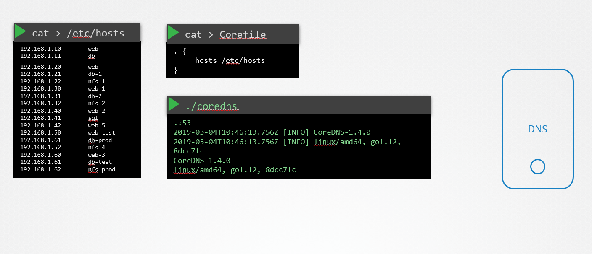

# Networking

## Switch Routing

Switch is connected to two devices. Each Device has an interface

ip link: eth0

ip addr add ... # to add an address

Router is a tool to connect two separate networks.

`route` is used to see the routing table.

Creating a Route from A to C.


```sh
ip route add 192.168.2/24 via 192.168.1.6 # Device B
```

Creating a Route from A to C.

```sh
# on device A
ip route add 192.168.2.0/24 via 192.168.1.6 # Device B
```

Creating a Route from C to A.

```sh
# on device A
ip route add 192.168.1.0/24 via 192.168.1.6 # Device B
```

To forward packets

```sh
echo 1 > /proc/sys/net/ipv4/ip_forward
# must set in network interfaces file to persist.
```

```sh
ip link # list interfaces on host 
ip addr # see addresses on interfaces 
ip addr add # add ip address to interface
ip route add # add a route
# must set in network interfaces file to persist.
```

## Prerequisites - DNS/CoreDNS

Prerequisite - CoreDNS
In the previous lecture we saw why you need a DNS server and how it can help manage name resolution in large environments with many hostnames and Ips and how you can configure your hosts to point to a DNS server. In this article we will see how to configure a host as a DNS server.

We are given a server dedicated as the DNS server, and a set of Ips to configure as entries in the server. There are many DNS server solutions out there, in this lecture we will focus on a particular one – CoreDNS.

So how do you get core dns? CoreDNS binaries can be downloaded from their Github releases page or as a docker image. Let’s go the traditional route. Download the binary using curl or wget. And extract it. You get the coredns executable.


Run the executable to start a DNS server. It by default listens on port 53, which is the default port for a DNS server.

Now we haven’t specified the IP to hostname mappings. For that you need to provide some configurations. There are multiple ways to do that. We will look at one. First we put all of the entries into the DNS servers /etc/hosts file.

And then we configure CoreDNS to use that file. CoreDNS loads it’s configuration from a file named Corefile. Here is a simple configuration that instructs CoreDNS to fetch the IP to hostname mappings from the file /etc/hosts. When the DNS server is run, it now picks the Ips and names from the /etc/hosts file on the server.



CoreDNS also supports other ways of configuring DNS entries through plugins. We will look at the plugin that it uses for Kubernetes in a later section.

Read more about CoreDNS here:

https://github.com/kubernetes/dns/blob/master/docs/specification.md

https://coredns.io/plugins/kubernetes/

## Prerequisite - Network Namespaces

If a Network is your house, the Namespaces are the rooms.

```sh
ip net add netns

ip netns exec red(ns) iplink

ip -n red link

ip link add veth-red type veth peer name veth-blue

ip link set veth-red netns red

ip link set veth-blue netns blue
```

Linux Bridge and Open VSwitch (OVS) are two virtual bridge networks on Linux


## Prerequisites - Docker Networking

docker0 = bridge (inside docker)

Docker uses iptables directly on the host to forward ports.

## Prerequisites - CNI

Nearly every implementations was going through the same commands to achieve the same networking isolation, forwarding, security goals.

CNIs Responsibility

- Container Runtime must create network namespace
- Identify Network the container must attach to
- Conatiner Runtime to invoke Network Plugin (bridge) when container is ADDed
- Container Runtime to invoke... DELeted
- JSON Format of the Network Configuration

- Must support ADD/DEL/CHECK cli
- Must support parameters container id, network ns, etc...
- Must manage IP Address assignment to PODs
- Must Return results in a specific format

Docker does not implement CNI but Container Network Model. So when Docker is used on K8s, K8s deploys the container with no network and manually adds a bridge.

## Cluster Networking

Nodes must have IPs, MACs and FQDN names.

Ports that are frequently used:

- 6443 (kube-api) Masters
- 10250 (kubelet) Masters and Workers
- 10259 (scheduler) Masters
- 10257 (contoller-manager) Masters
- 2379 (etcd) Masters
- 2380 (etcd clients) Masters


[Required Ports](https://kubernetes.io/docs/reference/networking/ports-and-protocols/)

## Important Note

In the upcoming labs, we will work with Network Addons. This includes installing a network plugin in the cluster. While we have used weave-net as an example, please bear in mind that you can use any of the plugins which are described here:

https://kubernetes.io/docs/concepts/cluster-administration/addons/

https://kubernetes.io/docs/concepts/cluster-administration/networking/#how-to-implement-the-kubernetes-networking-model

In the CKA exam, for a question that requires you to deploy a network addon, unless specifically directed, you may use any of the solutions described in the link above.

However, the documentation currently does not contain a direct reference to the exact command to be used to deploy a third-party network addon.

The links above redirect to third-party/vendor sites or GitHub repositories, which cannot be used in the exam. This has been intentionally done to keep the content in the Kubernetes documentation vendor-neutral.

NOTE: In the official exam, all essential CNI deployment details will be provided.

Lab Notes...

Question 9. Finding your default gateway IP... 

```sh
controlplane ~ ✖ ip route |grep default
default via 169.254.1.1 dev eth0 
```

Question 10. Finding kube-scheduler port...

```sh
controlplane ~ ✖ netstat -tulpn
Active Internet connections (only servers)
Proto Recv-Q Send-Q Local Address           Foreign Address         State       PID/Program name    
tcp        0      0 127.0.0.1:10259         0.0.0.0:*               LISTEN      3516/kube-scheduler 
tcp        0      0 127.0.0.1:10257         0.0.0.0:*               LISTEN      3841/kube-controlle 
tcp        0      0 127.0.0.1:10248         0.0.0.0:*               LISTEN      4100/kubelet        
tcp        0      0 127.0.0.1:10249         0.0.0.0:*               LISTEN      4583/kube-proxy     
tcp        0      0 127.0.0.1:34635         0.0.0.0:*               LISTEN      950/containerd      
tcp        0      0 0.0.0.0:22              0.0.0.0:*               LISTEN      952/sshd: /usr/sbin 
tcp        0      0 127.0.0.1:2379          0.0.0.0:*               LISTEN      3181/etcd           
tcp        0      0 127.0.0.1:2381          0.0.0.0:*               LISTEN      3181/etcd           
tcp        0      0 0.0.0.0:8080            0.0.0.0:*               LISTEN      954/ttyd            
tcp        0      0 127.0.0.53:53           0.0.0.0:*               LISTEN      530/systemd-resolve 
tcp        0      0 192.168.183.250:2379    0.0.0.0:*               LISTEN      3181/etcd           
tcp        0      0 192.168.183.250:2380    0.0.0.0:*               LISTEN      3181/etcd           
tcp6       0      0 :::10256                :::*                    LISTEN      4583/kube-proxy     
tcp6       0      0 :::10250                :::*                    LISTEN      4100/kubelet        
tcp6       0      0 :::8888                 :::*                    LISTEN      4282/kubectl        
tcp6       0      0 :::22                   :::*                    LISTEN      952/sshd: /usr/sbin 
tcp6       0      0 :::6443                 :::*                    LISTEN      3559/kube-apiserver 
udp        0      0 127.0.0.53:53           0.0.0.0:*                           530/systemd-resolve 
udp        0      0 0.0.0.0:8472            0.0.0.0:*                           -                   
```

Question 11. Number of connections on etcd ports (which has more)

```sh
controlplane ~ ➜  netstat -anp | grep ":2380"| wc -l
1

controlplane ~ ➜  netstat -anp | grep ":2379"| wc -l
120
```

## Pod Networking


```sh
# Then add

# Bring Up Interface
ip -n <namespace> link set
```

The CNI uses a set of commands implemented at a particular address of the host machine...


## CNI Weave

Lab Notes...

Question 1.

???

ANSWER

```sh
ps -aux | grep -i kubelet | grep container-runtime
```

Question 2.

```sh
# path to all the binaries of CNI supported plugins
ls -la /opt/cni/bin/
```

What plugins are available?

```sh
ls -la /opt/cni/bin/
```

What is the Configured Plugin?

```sh
ls -la /etc/cni/net.d/
```

What binary executable file will be run by kubelet after a container and its associated namespace are created?

???

ANSWER

```sh
cat /etc/cni/net.d/10-flannel.conflist
```

## Practice Test Deploy Network Solution

Lab Notes...

Pod behavior when there is no network configured.

Here weave-net was not deployed.

```sh
Events:
  Type     Reason                  Age                From               Message
  ----     ------                  ----               ----               -------
  Normal   Scheduled               111s               default-scheduler  Successfully assigned default/app to controlplane
  Warning  FailedCreatePodSandBox  110s               kubelet            Failed to create pod sandbox: rpc error: code = Unknown desc = failed to setup network for sandbox "2450aa405e8b5ef132181632744704fdfb423252a066ca45d964faa2ba87faf7": plugin type="weave-net" name="weave" failed (add): unable to allocate IP address: Post "http://127.0.0.1:6784/ip/2450aa405e8b5ef132181632744704fdfb423252a066ca45d964faa2ba87faf7": dial tcp 127.0.0.1:6784: connect: connection refused
  Normal   SandboxChanged          2s (x9 over 109s)  kubelet            Pod sandbox changed, it will be killed and re-created.
  Normal   Pulling                 1s                 kubelet            Pulling image "busybox"
  Normal   Pulled                  1s                 kubelet            Successfully pulled image "busybox" in 334ms (334ms including waiting). Image size: 2167089 bytes.
  Normal   Created                 1s                 kubelet            Created container app
```

Deploy Weave Net by applying the manifest.

```yaml
apiVersion: v1
kind: List
items:
  - apiVersion: v1
    kind: ServiceAccount
    metadata:
      name: weave-net
      labels:
        name: weave-net
      namespace: kube-system
  - apiVersion: rbac.authorization.k8s.io/v1
    kind: ClusterRole
    metadata:
      name: weave-net
      labels:
        name: weave-net
    rules:
      - apiGroups:
          - ''
        resources:
          - pods
          - namespaces
          - nodes
        verbs:
          - get
          - list
          - watch
      - apiGroups:
          - extensions
        resources:
          - networkpolicies
        verbs:
          - get
          - list
          - watch
      - apiGroups:
          - 'networking.k8s.io'
        resources:
          - networkpolicies
        verbs:
          - get
          - list
          - watch
      - apiGroups:
        - ''
        resources:
        - nodes/status
        verbs:
        - patch
        - update
  - apiVersion: rbac.authorization.k8s.io/v1
    kind: ClusterRoleBinding
    metadata:
      name: weave-net
      labels:
        name: weave-net
    roleRef:
      kind: ClusterRole
      name: weave-net
      apiGroup: rbac.authorization.k8s.io
    subjects:
      - kind: ServiceAccount
        name: weave-net
        namespace: kube-system
  - apiVersion: rbac.authorization.k8s.io/v1
    kind: Role
    metadata:
      name: weave-net
      namespace: kube-system
      labels:
        name: weave-net
    rules:
      - apiGroups:
          - ''
        resources:
          - configmaps
        resourceNames:
          - weave-net
        verbs:
          - get
          - update
      - apiGroups:
          - ''
        resources:
          - configmaps
        verbs:
          - create
  - apiVersion: rbac.authorization.k8s.io/v1
    kind: RoleBinding
    metadata:
      name: weave-net
      namespace: kube-system
      labels:
        name: weave-net
    roleRef:
      kind: Role
      name: weave-net
      apiGroup: rbac.authorization.k8s.io
    subjects:
      - kind: ServiceAccount
        name: weave-net
        namespace: kube-system
  - apiVersion: apps/v1
    kind: DaemonSet
    metadata:
      name: weave-net
      labels:
        name: weave-net
      namespace: kube-system
    spec:
      # Wait 5 seconds to let pod connect before rolling next pod
      selector:
        matchLabels:
          name: weave-net
      minReadySeconds: 5
      template:
        metadata:
          labels:
            name: weave-net
        spec:
          initContainers:
            - name: weave-init
              image: 'weaveworks/weave-kube:2.8.1'
              command:
                - /home/weave/init.sh
              env:
              securityContext:
                privileged: true
              volumeMounts:
                - name: cni-bin
                  mountPath: /host/opt
                - name: cni-bin2
                  mountPath: /host/home
                - name: cni-conf
                  mountPath: /host/etc
                - name: lib-modules
                  mountPath: /lib/modules
                - name: xtables-lock
                  mountPath: /run/xtables.lock
                  readOnly: false
          containers:
            - name: weave
              command:
                - /home/weave/launch.sh
              env:
                - name: IPALLOC_RANGE
                  value: 10.32.1.0/24
                - name: INIT_CONTAINER
                  value: "true"
                - name: HOSTNAME
                  valueFrom:
                    fieldRef:
                      apiVersion: v1
                      fieldPath: spec.nodeName
              image: 'weaveworks/weave-kube:2.8.1'
              readinessProbe:
                httpGet:
                  host: 127.0.0.1
                  path: /status
                  port: 6784
              resources:
                requests:
                  cpu: 50m
              securityContext:
                privileged: true
              volumeMounts:
                - name: weavedb
                  mountPath: /weavedb
                - name: dbus
                  mountPath: /host/var/lib/dbus
                  readOnly: true
                - mountPath: /host/etc/machine-id
                  name: cni-machine-id
                  readOnly: true
                - name: xtables-lock
                  mountPath: /run/xtables.lock
                  readOnly: false
            - name: weave-npc
              env:
                - name: HOSTNAME
                  valueFrom:
                    fieldRef:
                      apiVersion: v1
                      fieldPath: spec.nodeName
              image: 'weaveworks/weave-npc:2.8.1'
#npc-args
              resources:
                requests:
                  cpu: 50m
              securityContext:
                privileged: true
              volumeMounts:
                - name: xtables-lock
                  mountPath: /run/xtables.lock
                  readOnly: false
          hostNetwork: true
          dnsPolicy: ClusterFirstWithHostNet
          hostPID: false
          restartPolicy: Always
          securityContext:
            seLinuxOptions: {}
          serviceAccountName: weave-net
          tolerations:
            - effect: NoSchedule
              operator: Exists
            - effect: NoExecute
              operator: Exists
          volumes:
            - name: weavedb
              hostPath:
                path: /var/lib/weave
            - name: cni-bin
              hostPath:
                path: /opt
            - name: cni-bin2
              hostPath:
                path: /home
            - name: cni-conf
              hostPath:
                path: /etc
            - name: cni-machine-id
              hostPath:
                path: /etc/machine-id
            - name: dbus
              hostPath:
                path: /var/lib/dbus
            - name: lib-modules
              hostPath:
                path: /lib/modules
            - name: xtables-lock
              hostPath:
                path: /run/xtables.lock
                type: FileOrCreate
          priorityClassName: system-node-critical
      updateStrategy:
        type: RollingUpdate
```

??? Solution covers more regarding weavenet deployments and configuring from the online manifest. The solution covers the use of the config map in the kube-proxy and using that for the IP_ALLOC field of the weavenet manifest. 
[Follow up](https://samaritanspurse.udemy.com/course/certified-kubernetes-administrator-with-practice-tests/learn/lecture/21739724#overview)


