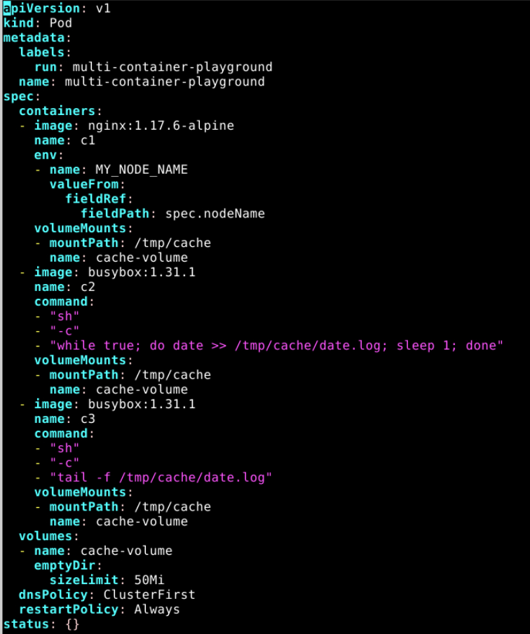
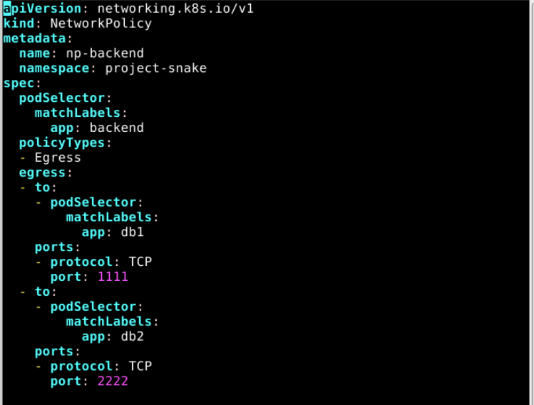

# KILLER SHELL PRACTICE EXAMS

## Pre-requisites

```sh
alias k=kubectl                         # will already be pre-configured

export do="--dry-run=client -o yaml"    # k create deploy nginx --image=nginx $do

export now="--force --grace-period 0"   # k delete pod x $now
```

## Questions

### Q.1.

You have access to multiple clusters from your main terminal through kubectl contexts. Write all those context names into /opt/course/1/contexts.

Next write a command to display the current context into /opt/course/1/context_default_kubectl.sh, the command should use kubectl.

Finally write a second command doing the same thing into /opt/course/1/context_default_no_kubectl.sh, but without the use of kubectl.

kubectl top pod --containers=true

### Q.2.

Use context: kubectl config use-context k8s-c1-H

Create a single Pod of image httpd:2.4.41-alpine in Namespace default. The Pod should be named pod1 and the container should be named pod1-container. This Pod should only be scheduled on controlplane nodes. Do not add new labels to any nodes.

### Q.3.

Use context: kubectl config use-context k8s-c1-H

There are two Pods named o3db-* in Namespace project-c13. C13 Management asked you to scale the Pods down to one replica to save resources.

### Q.4.

Use context: kubectl config use-context k8s-c1-H

Do the following in Namespace default. Create a single Pod named ready-if-service-ready of image nginx:1.16.1-alpine. Configure a LivenessProbe which simply executes command true. Also configure a ReadinessProbe which does check if the url h`ttp://service-am-i-ready:80` is reachable, you can use `wget -T2 -O- http://service-am-i-ready:80` for this. Start the Pod and confirm it isn't ready because of the ReadinessProbe.

Create a second Pod named am-i-ready of image `nginx:1.16.1-alpine` with label id: cross-server-ready. The already existing Service service-am-i-ready should now have that second Pod as endpoint.

Now the first Pod should be in ready state, confirm that.

SOLUTION: It's a bit of an anti-pattern for one Pod to check another Pod for being ready using probes, hence the normally available readinessProbe.httpGet doesn't work for absolute remote urls. Still the workaround requested in this task should show how probes and Pod<->Service communication works.

First we create the first Pod:

```sh
k run ready-if-service-ready --image=nginx:1.16.1-alpine $do > 4_pod1.yaml

vim 4_pod1.yaml
```

```yaml
# 4_pod1.yaml
apiVersion: v1
kind: Pod
metadata:
  creationTimestamp: null
  labels:
    run: ready-if-service-ready
  name: ready-if-service-ready
spec:
  containers:
  - image: nginx:1.16.1-alpine
    name: ready-if-service-ready
    resources: {}
    livenessProbe:                                      # add from here
      exec:
        command:
        - 'true'
    readinessProbe:
      exec:
        command:
        # THIS WAS PAINFUL???
        - sh
        - -c
        - 'wget -T2 -O- http://service-am-i-ready:80'   # to here
  dnsPolicy: ClusterFirst
  restartPolicy: Always
status: {}
```

### Q.5.

Use context: kubectl config use-context k8s-c1-H

There are various Pods in all namespaces. Write a command into `/opt/course/5/find_pods.sh` which lists all Pods sorted by their AGE (metadata.creationTimestamp).

Write a second command into `/opt/course/5/find_pods_uid.sh` which lists all Pods sorted by field metadata.uid. Use kubectl sorting for both commands.

SOLUTION: 

```sh
# /opt/course/5/find_pods.sh
kubectl get pod -A --sort-by=.metadata.creationTimestamp
```

```sh
# /opt/course/5/find_pods_uid.sh
kubectl get pod -A --sort-by=.metadata.uid
```

### Q.6.

Use context: kubectl config use-context k8s-c1-H

Create a new PersistentVolume named safari-pv. It should have a capacity of 2Gi, accessMode ReadWriteOnce, hostPath /Volumes/Data and no storageClassName defined.

Next create a new PersistentVolumeClaim in Namespace project-tiger named safari-pvc . It should request 2Gi storage, accessMode ReadWriteOnce and should not define a storageClassName. The PVC should bound to the PV correctly.

Finally create a new Deployment safari in Namespace project-tiger which mounts that volume at /tmp/safari-data. The Pods of that Deployment should be of image httpd:2.4.41-alpine.

```yaml
# 6_pv.yaml
kind: PersistentVolume
apiVersion: v1
metadata:
 name: safari-pv
spec:
 capacity:
  storage: 2Gi
 accessModes:
  - ReadWriteOnce
 hostPath:
  path: "/Volumes/Data"
```

```yaml
# 6_pvc.yaml
kind: PersistentVolumeClaim
apiVersion: v1
metadata:
  name: safari-pvc
  namespace: project-tiger
spec:
  accessModes:
    - ReadWriteOnce
  resources:
    requests:
     storage: 2Gi
```

```sh
k -n project-tiger create deploy safari \
  --image=httpd:2.4.41-alpine $do > 6_dep.yaml

vim 6_dep.yaml
```

```yaml
# 6_dep.yaml
apiVersion: apps/v1
kind: Deployment
metadata:
  creationTimestamp: null
  labels:
    app: safari
  name: safari
  namespace: project-tiger
spec:
  replicas: 1
  selector:
    matchLabels:
      app: safari
  strategy: {}
  template:
    metadata:
      creationTimestamp: null
      labels:
        app: safari
    spec:
      volumes:                                      # add
      - name: data                                  # add
        persistentVolumeClaim:                      # add
          claimName: safari-pvc                     # add
      containers:
      - image: httpd:2.4.41-alpine
        name: container
        volumeMounts:                               # add
        - name: data                                # add
          mountPath: /tmp/safari-data               # add
```

### Q.7. Use context: kubectl config use-context k8s-c1-H

The metrics-server has been installed in the cluster. Your college would like to know the kubectl commands to:

show Nodes resource usage

show Pods and their containers resource usage

Please write the commands into /opt/course/7/node.sh and /opt/course/7/pod.sh.

SOLUTION:

```sh
# /opt/course/7/node.sh
kubectl top node

# /opt/course/7/pod.sh
kubectl top pod --containers=true
```

### Q.8.

SOLUTION:

ssh to controlplane...

```sh
find /usr/lib/systemd | grep kube
ps aux | grep kubelet # shows kubelet process
find /usr/lib/systemd | grep kube

find /usr/lib/systemd | grep etcd

find /etc/kubernetes/manifests/ # shows static pods
kubectl -n kube-system get pod -o wide | grep controlplane1

kubectl -n kube-system get deploy

# output...
# /opt/course/8/controlplane-components.txt
kubelet: process
kube-apiserver: static-pod
kube-scheduler: static-pod
kube-controller-manager: static-pod
etcd: static-pod
dns: pod coredns
```

### Q.9.

Kill Scheduler, Manual Scheduling

SOLUTION:

Watch your context. This was applied to the wrong cluster.

### Q.10.

RBAC ServiceAccount Role RoleBinding

Verification:

```sh
k -n project-hamster auth can-i create secret --as system:serviceaccount:project-hamster:processor
```

SOLUTION:

Watch your context. This was applied to the wrong cluster.

### Q.11.

DaemonSet on all Nodes

Use context: kubectl config use-context k8s-c1-H

Use Namespace project-tiger for the following. Create a DaemonSet named ds-important with image httpd:2.4-alpine and labels id=ds-important and uuid=18426a0b-5f59-4e10-923f-c0e078e82462.

The Pods it creates should request 10 millicore cpu and 10 mebibyte memory. The Pods of that DaemonSet should run on all nodes, also controlplanes.


### Q.12.

Use context: kubectl config use-context k8s-c1-H

Implement the following in Namespace project-tiger:

Create a Deployment named deploy-important with 3 replicas
The Deployment and its Pods should have label id=very-important
It should have two containers:
First named container1 with image nginx:1.17.6-alpine
Second named container2 with image google/pause
There should only ever be one Pod of that Deployment running on one worker node, use topologyKey: kubernetes.io/hostname for this

### Q.13. 

Use context: kubectl config use-context k8s-c1-H

Create a Pod named multi-container-playground in Namespace default with three containers, named c1, c2 and c3. There should be a volume attached to that Pod and mounted into every container, but the volume shouldn't be persisted or shared with other Pods.

Container c1 should be of image nginx:1.17.6-alpine and have the name of the node where its Pod is running available as environment variable MY_NODE_NAME.

Container c2 should be of image busybox:1.31.1 and write the output of the date command every second in the shared volume into file date.log. You can use while true; do date >> /your/vol/path/date.log; sleep 1; done for this.

Container c3 should be of image busybox:1.31.1 and constantly send the content of file date.log from the shared volume to stdout. You can use tail -f /your/vol/path/date.log for this.

Check the logs of container c3 to confirm correct setup.

SOLUTION:



### Q.14.

Use context: kubectl config use-context k8s-c1-H

You're ask to find out following information about the cluster k8s-c1-H :

How many controlplane nodes are available?
How many worker nodes are available?
What is the Service CIDR?
Which Networking (or CNI Plugin) is configured and where is its config file?
Which suffix will static pods have that run on cluster1-node1?
Write your answers into file /opt/course/14/cluster-info, structured like this:

```sh
# /opt/course/14/cluster-info
1: [ANSWER]
2: [ANSWER]
3: [ANSWER]
4: [ANSWER]
5: [ANSWER]
```

### Q.15.

Use context: kubectl config use-context k8s-c2-AC

Write a command into /opt/course/15/cluster_events.sh which shows the latest events in the whole cluster, ordered by time (metadata.creationTimestamp). Use kubectl for it.

Now delete the kube-proxy Pod running on node cluster2-node1 and write the events this caused into /opt/course/15/pod_kill.log.

Finally kill the containerd container of the kube-proxy Pod on node cluster2-node1 and write the events into /opt/course/15/container_kill.log.

Do you notice differences in the events both actions caused?

### Q.16. Use context: kubectl config use-context k8s-c1-H

Write the names of all namespaced Kubernetes resources (like Pod, Secret, ConfigMap...) into /opt/course/16/resources.txt.

Find the project-* Namespace with the highest number of Roles defined in it and write its name and amount of Roles into /opt/course/16/crowded-namespace.txt.

### Q.17.

Use context: kubectl config use-context k8s-c1-H

In Namespace project-tiger create a Pod named tigers-reunite of image httpd:2.4.41-alpine with labels pod=container and container=pod. Find out on which node the Pod is scheduled. Ssh into that node and find the containerd container belonging to that Pod.

Using command crictl:

Write the ID of the container and the info.runtimeType into /opt/course/17/pod-container.txt

Write the logs of the container into /opt/course/17/pod-container.log

### Q.18.

Use context: kubectl config use-context k8s-c3-CCC

There seems to be an issue with the kubelet not running on cluster3-node1. Fix it and confirm that cluster has node cluster3-node1 available in Ready state afterwards. You should be able to schedule a Pod on cluster3-node1 afterwards.

Write the reason of the issue into /opt/course/18/reason.txt.

### Q.19.

ℹ️ This task can only be solved if questions 18 or 20 have been successfully implemented and the k8s-c3-CCC cluster has a functioning worker node

Use context: kubectl config use-context k8s-c3-CCC

Do the following in a new Namespace secret. Create a Pod named secret-pod of image busybox:1.31.1 which should keep running for some time.

There is an existing Secret located at /opt/course/19/secret1.yaml, create it in the Namespace secret and mount it readonly into the Pod at /tmp/secret1.

Create a new Secret in Namespace secret called secret2 which should contain user=user1 and pass=1234. These entries should be available inside the Pod's container as environment variables APP_USER and APP_PASS.

Confirm everything is working.

### Q.20.

Use context: kubectl config use-context k8s-c3-CCC

Your coworker said node cluster3-node2 is running an older Kubernetes version and is not even part of the cluster. Update Kubernetes on that node to the exact version that's running on cluster3-controlplane1. Then add this node to the cluster. Use kubeadm for this.

SOLUTION:

```sh
ssh <node>

kubelet --version
kubectl version
kubeadm version

kubeadm upgrade
# "couldn't create a Kubernetes client from file "/etc/kubernetes/# kubelet.conf": failed to load admin kubeconfig: open /etc/kubernetes/kubelet.conf: no such file or directory"
# THIS ERROR INDICATES IT HAS NEVER JOINED.
# AFTER YOUR UPGRADE JOIN THE CLUSTER

sudo apt show kubectl -a | grep <version on controlplane>

sudo apt list kubeadm # Note the version. Check it against the control plane. They are the same which means this node hasn't joined the cluster.

# On the Control Plane, list the tokens
kubeadm token list # Check Expiration

# On the Control Plane, get a hash of the ca certificate
sudo cat /etc/kubernetes/pki/ca.crt | openssl x509 -pubkey  | openssl rsa -pubin -outform der 2>/dev/null | \
   openssl dgst -sha256 -hex | sed 's/^.* //'
# 8cb2de97839780a412b93877f8507ad6c94f73add17d5d7058e91741c9d5ec78

sudo kubeadm join --token 5didvk.d09sbcov8ph2amjw <control-plane-host>:6443 --discovery-token-ca-cert-hash sha256:8cb2de97839780a412b93877f8507ad6c94f73add17d5d7058e91741c9d5ec78

# On a kubectl client, check the nodes that it joined.

```

??? Review normal kubeadm upgrade procedures too.

<https://kubernetes.io/docs/tasks/administer-cluster/kubeadm/kubeadm-upgrade>

### Q.21.

Use context: kubectl config use-context k8s-c3-CCC

Create a Static Pod named my-static-pod in Namespace default on cluster3-controlplane1. It should be of image nginx:1.16-alpine and have resource requests for 10m CPU and 20Mi memory.

Then create a NodePort Service named static-pod-service which exposes that static Pod on port 80 and check if it has Endpoints and if it's reachable through the cluster3-controlplane1 internal IP address. You can connect to the internal node IPs from your main terminal.

??? Revisit Creating Services...

SOLUTION

### Q.22.

Use context: kubectl config use-context k8s-c2-AC

Check how long the kube-apiserver server certificate is valid on cluster2-controlplane1. Do this with openssl or cfssl. Write the expiration date into /opt/course/22/expiration.

Also run the correct kubeadm command to list the expiration dates and confirm both methods show the same date.

Write the correct kubeadm command that would renew the apiserver server certificate into /opt/course/22/kubeadm-renew-certs.sh.

SOLUTION:

```sh
openssl x509 -in /etc/kubernetes/pki/apiserver.crt -text -noout 

kubeadm certs check-expiration
```

??? I need to study more of the openssl commands.
### Q.23.

Use context: kubectl config use-context k8s-c2-AC

Node cluster2-node1 has been added to the cluster using kubeadm and TLS bootstrapping.

Find the "Issuer" and "Extended Key Usage" values of the cluster2-node1:

kubelet client certificate, the one used for outgoing connections to the kube-apiserver.
kubelet server certificate, the one used for incoming connections from the kube-apiserver.
Write the information into file /opt/course/23/certificate-info.txt.

Compare the "Issuer" and "Extended Key Usage" fields of both certificates and make sense of these.

SOLUTION:

```sh
openssl x509  -noout -text -in /var/lib/kubelet/pki/kubelet-client-current.pem | grep Issuer  
        Issuer: CN = kubernetes

openssl x509  -noout -text -in /var/lib/kubelet/pki/kubelet-client-current.pem | grep "Extended Key Usage" -A1
            X509v3 Extended Key Usage: 
                TLS Web Client Authentication

openssl x509  -noout -text -in /var/lib/kubelet/pki/kubelet.crt | grep Issuer
          Issuer: CN = cluster2-node1-ca@1588186506

openssl x509  -noout -text -in /var/lib/kubelet/pki/kubelet.crt | grep "Extended Key Usage" -A1
            X509v3 Extended Key Usage: 
                TLS Web Server Authentication
```

??? I need more familiarity with `openssl x509 -noout -text -in...`

### Q.24.

Use context: kubectl config use-context k8s-c1-H

There was a security incident where an intruder was able to access the whole cluster from a single hacked backend Pod.

To prevent this create a NetworkPolicy called np-backend in Namespace project-snake. It should allow the backend-* Pods only to:

connect to db1-* Pods on port 1111
connect to db2-* Pods on port 2222
Use the app label of Pods in your policy.

After implementation, connections from backend-* Pods to vault-* Pods on port 3333 should for example no longer work.

SOLUTION:

```sh
➜ k -n project-snake get pod -L app
NAME        READY   STATUS    RESTARTS   AGE     APP
backend-0   1/1     Running   0          3m15s   backend
db1-0       1/1     Running   0          3m15s   db1
db2-0       1/1     Running   0          3m17s   db2
vault-0     1/1     Running   0          3m17s   vault

➜ k -n project-snake get pod -o wide
NAME        READY   STATUS    RESTARTS   AGE     IP          ...
backend-0   1/1     Running   0          4m14s   10.44.0.24  ...
db1-0       1/1     Running   0          4m14s   10.44.0.25  ...
db2-0       1/1     Running   0          4m16s   10.44.0.23  ...
vault-0     1/1     Running   0          4m16s   10.44.0.22  ...

➜ k -n project-snake exec backend-0 -- curl -s 10.44.0.25:1111
database one

➜ k -n project-snake exec backend-0 -- curl -s 10.44.0.23:2222
database two

➜ k -n project-snake exec backend-0 -- curl -s 10.44.0.22:3333
vault secret storage

```




### Q.25.

Use context: kubectl config use-context k8s-c3-CCC

Make a backup of etcd running on cluster3-controlplane1 and save it on the controlplane node at /tmp/etcd-backup.db.

Then create any kind of Pod in the cluster.

Finally restore the backup, confirm the cluster is still working and that the created Pod is no longer with us.

Extra Question 1

Use context: kubectl config use-context k8s-c1-H

Check all available Pods in the Namespace project-c13 and find the names of those that would probably be terminated first if the Nodes run out of resources (cpu or memory) to schedule all Pods. Write the Pod names into /opt/course/e1/pods-not-stable.txt.

Extra Question 2
Use context: kubectl config use-context k8s-c1-H

There is an existing ServiceAccount secret-reader in Namespace project-hamster. Create a Pod of image curlimages/curl:7.65.3 named tmp-api-contact which uses this ServiceAccount. Make sure the container keeps running.

Exec into the Pod and use curl to access the Kubernetes Api of that cluster manually, listing all available secrets. You can ignore insecure https connection. Write the command(s) for this into file /opt/course/e4/list-secrets.sh.

Preview Question 1
Use context: kubectl config use-context k8s-c2-AC

The cluster admin asked you to find out the following information about etcd running on cluster2-controlplane1:

Server private key location
Server certificate expiration date
Is client certificate authentication enabled
Write these information into /opt/course/p1/etcd-info.txt

Finally you're asked to save an etcd snapshot at /etc/etcd-snapshot.db on cluster2-controlplane1 and display its status.

Preview Question 2
Use context: kubectl config use-context k8s-c1-H

You're asked to confirm that kube-proxy is running correctly on all nodes. For this perform the following in Namespace project-hamster:

Create a new Pod named p2-pod with two containers, one of image nginx:1.21.3-alpine and one of image busybox:1.31. Make sure the busybox container keeps running for some time.

Create a new Service named p2-service which exposes that Pod internally in the cluster on port 3000->80.

Find the kube-proxy container on all nodes cluster1-controlplane1, cluster1-node1 and cluster1-node2 and make sure that it's using iptables. Use command crictl for this.

Write the iptables rules of all nodes belonging the created Service p2-service into file /opt/course/p2/iptables.txt.

Finally delete the Service and confirm that the iptables rules are gone from all nodes.

Preview Question 3
Use context: kubectl config use-context k8s-c2-AC

Create a Pod named check-ip in Namespace default using image httpd:2.4.41-alpine. Expose it on port 80 as a ClusterIP Service named check-ip-service. Remember/output the IP of that Service.

Change the Service CIDR to 11.96.0.0/12 for the cluster.

Then create a second Service named check-ip-service2 pointing to the same Pod to check if your settings did take effect. Finally check if the IP of the first Service has changed.