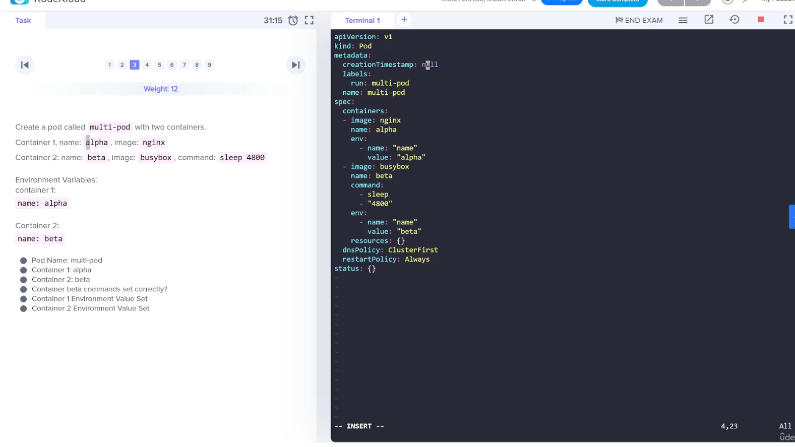
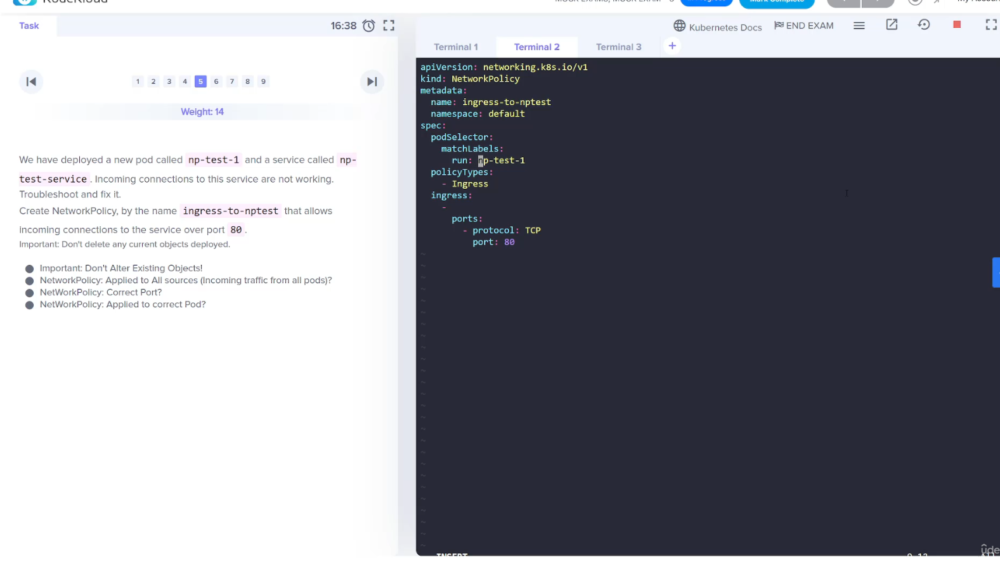
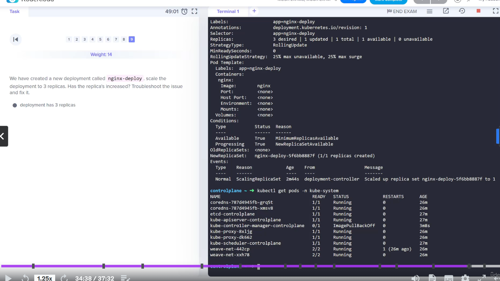

# Section 16 Mock Exams

## Mock Exam 1

### Q.10.

Expose the hr-web-app created in the previous task as a service named hr-web-app-service, accessible on port 30082 on the nodes of the cluster.

The web application listens on port 8080.

Solution:
Run the command: kubectl expose deployment hr-web-app --type=NodePort --port=8080 --name=hr-web-app-service --dry-run=client -o yaml > hr-web-app-service.yaml to generate a service definition file.

Now, in generated service definition file add the nodePort field with the given port number under the ports section and create a service.

> NOTE: NodePort service 'nodePort' value must be specified as a key/value in the ports section as...

```yaml
spec:
  ports:
  - nodePort: 30082
    port: 8080
    protocol: TCP
    targetPort: 8080    
```

Run your kubectl command (imperative) to generate a sample yaml, or edit the service when it is up and running.

```sh
k expose deploy hr-web-app --name=web-app-service --type NodePort --port 8080
```

> NOTE: Study more on the service types (LB, NP, ClusterIP)

### Q.9.

> NOTE: When checking the logs of an initContainer just put the container name after the pod name.

## Mock Exam 2

### Q.7.

Create a nginx pod called nginx-resolver using image nginx, expose it internally with a service called nginx-resolver-service. Test that you are able to look up the service and pod names from within the cluster. Use the image: busybox:1.28 for dns lookup. Record results in /root/CKA/nginx.svc and /root/CKA/nginx.pod

SOLUTION:

Use the command kubectl run and create a nginx pod and busybox pod. Resolve it, nginx service and its pod name from busybox pod.

To create a pod nginx-resolver and expose it internally:

```sh
kubectl run nginx-resolver --image=nginx
kubectl expose pod nginx-resolver --name=nginx-resolver-service --port=80 --target-port=80 --type=ClusterIP
```

To create a pod test-nslookup. Test that you are able to look up the service and pod names from within the cluster:

```sh
kubectl run test-nslookup --image=busybox:1.28 --rm -it --restart=Never -- nslookup nginx-resolver-service

kubectl run test-nslookup --image=busybox:1.28 --rm -it --restart=Never -- nslookup nginx-resolver-service > /root/CKA/nginx.svc
```

Get the IP of the nginx-resolver pod and replace the dots(.) with hyphen(-) which will be used below.

```sh
kubectl get pod nginx-resolver -o wide # or 'get ep"

kubectl run test-nslookup --image=busybox:1.28 --rm -it --restart=Never -- nslookup <P-O-D-I-P.default.pod> > /root/CKA/nginx.pod
```

### Q.6.

Create a new user called john. Grant him access to the cluster. John should have permission to create, list, get, update and delete pods in the development namespace . The private key exists in the location: /root/CKA/john.key and csr at /root/CKA/john.csr.

Important Note: As of kubernetes 1.19, the CertificateSigningRequest object expects a signerName.

Please refer the documentation to see an example. The documentation tab is available at the top right of terminal.

SOLUTION:
Solution manifest file to create a CSR as follows:

```sh
openssl genrsa -out test.key 2048

openssl req -new -key test.key -subj="/CN=test" -out test.csr 

cat test.csr | base64 | tr -d "/n" # This is copied into the CSR yaml

```

```yaml
---
apiVersion: certificates.k8s.io/v1
kind: CertificateSigningRequest
metadata:
  name: john-developer
spec:
  signerName: kubernetes.io/kube-apiserver-client
  request: LS0tLS1CRUdJTiBDRVJUSUZJQ0FURSBSRVFVRVNULS0tLS0KTUlJQ1ZEQ0NBVHdDQVFBd0R6RU5NQXNHQTFVRUF3d0VhbTlvYmpDQ0FTSXdEUVlKS29aSWh2Y05BUUVCQlFBRApnZ0VQQURDQ0FRb0NnZ0VCQUt2Um1tQ0h2ZjBrTHNldlF3aWVKSzcrVVdRck04ZGtkdzkyYUJTdG1uUVNhMGFPCjV3c3cwbVZyNkNjcEJFRmVreHk5NUVydkgyTHhqQTNiSHVsTVVub2ZkUU9rbjYra1NNY2o3TzdWYlBld2k2OEIKa3JoM2prRFNuZGFvV1NPWXBKOFg1WUZ5c2ZvNUpxby82YU92czFGcEc3bm5SMG1JYWpySTlNVVFEdTVncGw4bgpjakY0TG4vQ3NEb3o3QXNadEgwcVpwc0dXYVpURTBKOWNrQmswZWhiV2tMeDJUK3pEYzlmaDVIMjZsSE4zbHM4CktiSlRuSnY3WDFsNndCeTN5WUFUSXRNclpUR28wZ2c1QS9uREZ4SXdHcXNlMTdLZDRaa1k3RDJIZ3R4UytkMEMKMTNBeHNVdzQyWVZ6ZzhkYXJzVGRMZzcxQ2NaanRxdS9YSmlyQmxVQ0F3RUFBYUFBTUEwR0NTcUdTSWIzRFFFQgpDd1VBQTRJQkFRQ1VKTnNMelBKczB2czlGTTVpUzJ0akMyaVYvdXptcmwxTGNUTStsbXpSODNsS09uL0NoMTZlClNLNHplRlFtbGF0c0hCOGZBU2ZhQnRaOUJ2UnVlMUZnbHk1b2VuTk5LaW9FMnc3TUx1a0oyODBWRWFxUjN2SSsKNzRiNnduNkhYclJsYVhaM25VMTFQVTlsT3RBSGxQeDNYVWpCVk5QaGhlUlBmR3p3TTRselZuQW5mNm96bEtxSgpvT3RORStlZ2FYWDdvc3BvZmdWZWVqc25Yd0RjZ05pSFFTbDgzSkljUCtjOVBHMDJtNyt0NmpJU3VoRllTVjZtCmlqblNucHBKZWhFUGxPMkFNcmJzU0VpaFB1N294Wm9iZDFtdWF4bWtVa0NoSzZLeGV0RjVEdWhRMi80NEMvSDIKOWk1bnpMMlRST3RndGRJZjAveUF5N05COHlOY3FPR0QKLS0tLS1FTkQgQ0VSVElGSUNBVEUgUkVRVUVTVC0tLS0tCg==
  usages:
  - digital signature
  - key encipherment
  - client auth
```

To approve this certificate, run: `kubectl certificate approve john-developer`

Next, create a role developer and rolebinding developer-role-binding, run the command:

```sh
kubectl create role developer --resource=pods --verb=create,list,get,update,delete --namespace=development


kubectl create rolebinding developer-role-binding --role=developer --user=john --namespace=development
```

To verify the permission from kubectl utility tool:

```sh
kubectl auth can-i update pods --as=john --namespace=development
```

### Q.4.

Task:
A pod definition file is created at /root/CKA/use-pv.yaml. Make use of this manifest file and mount the persistent volume called pv-1. Ensure the pod is running and the PV is bound.

mountPath: /data

persistentVolumeClaim Name: my-pvc

SOLUTION:

Add a persistentVolumeClaim definition to pod definition file.

Solution manifest file to create a pvc my-pvc as follows:

```yaml
---
apiVersion: v1
kind: PersistentVolumeClaim
metadata:
  name: my-pvc
spec:
  accessModes:
  - ReadWriteOnce
  resources:
    requests:
       storage: 10Mi
```

And then, update the pod definition file as follows:

```yaml
apiVersion: v1
kind: Pod
metadata:
  creationTimestamp: null
  labels:
    run: use-pv
  name: use-pv
spec:
  containers:
  - image: nginx
    name: use-pv
    volumeMounts:
    - mountPath: "/data"
      name: mypd
  volumes:
    - name: mypd
      persistentVolumeClaim:
        claimName: my-pvc
```

Finally, create the pod by running:

```sh
kubectl create -f /root/CKA/use-pv.yaml
```

## Mock Exam 3

How do you check 'can-i' on service accounts?

```sh
k -n namespace auth can-i <verb> <resource> --as system:serviceaccount:<namespace>:<serviceaccount-name>
```

### Q.1.

SOLUTION:

```sh
kubectl create clusterrolebinding pvviewer-role-binding --cluster-role pvviewer-role --serviceaccount=default:pvviewer

kubectl run pvviewer --image=redis --dry-run=client -o yaml > pvviewer.yaml
```

```yaml
...
serviceAccountName: pvviewer
...
```

### Q.3.

SOLUTION:



> NOTE: The Environment Variables must be in the key/value form where the 'key' is the word 'name'.

### Q.5.

SOLUTION:



> NOTE: The `spec.ingress` with an empty list indicates all pods in the namespace.

```sh
# test with curl pod
k run curl --image=curl:alpine --rm -it -- sh
> curl np-test-service
```

### Q.8.

SOLUTION:

Use `--kubeconfig` to load a different context to obtain our error and validate configs are working.

```sh
kubectl get nodes --kubeconfig=/root/CKA/super.kubeconfig 
```

### Q.9.

SOLUTION:

This question is to get you to investigate the controller-manager. Do not assume you are done because you have set the scaled flag. Validate the result. Here the controller manager pod is in an ImagePullBackoff.



> NOTE: A misspelling on the kube-controller-manager manifest file was enough to cause a imagePullBackOff, in turn ignoring the scaling request for the pod.
